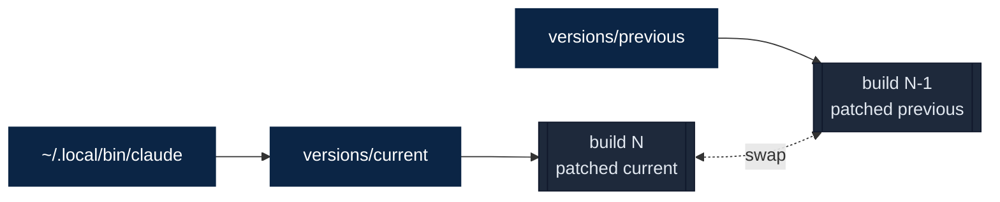
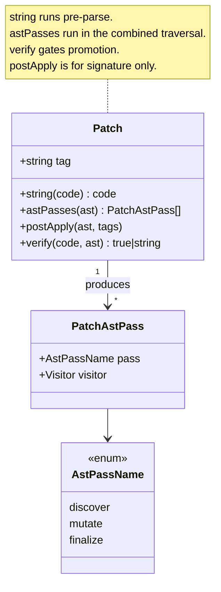

<p align="center">
  <h1 align="center">cc-enhanced</h1>
  <p align="center">AST-based patcher for customizing the Claude Code CLI</p>
</p>

<p align="center">
  <a href="LICENSE"></a>
  
  
  
  
</p>

---

cc-enhanced extracts the JavaScript bundle embedded in the Claude Code native binary, applies 41 verifiable patches through Babel AST traversal, and repacks the result in place. Every patch is a self-contained module with an independent verifier; one failure does not take down the rest. Promotion uses atomic symlinks, so rollback is one command.

Use it to unlock capabilities the CLI ships with but does not expose, fix long-standing bugs (shell quoting and LSP fan-out), swap tool parameters for more ergonomic alternatives (`bat`-style ranges on Read and batched `edits[]` on Edit), and replace prompt fragments that steer the model toward better shell tooling.

> [!NOTE]
> This tool patches your local copy of the Claude Code binary. It does not distribute Claude Code binaries or npm packages. All modifications happen on your machine.

## How It Works

```mermaid
flowchart LR
    Bin([native binary]) -->|unpack ELF| Js[cli.js]

    Js --> Str[string patches<br/>prompt text only]
    Str --> Ast

    subgraph Ast[combined AST pass]
        direction LR
        D[discover] --> M[mutate] --> F[finalize]
    end

    Ast --> Ver{{each patch<br/>verifier}}
    Ver -- all pass --> Sig[signature suffix]
    Ver -- any fail --> Abort([abort + report])
    Sig --> Repack[repack into ELF<br/>same byte length]
    Repack --> Swap[atomic symlink swap]
    Swap --> Active([active binary])
    Active -. mise run native:rollback .-> Swap

    classDef terminal fill:#1f2937,stroke:#111,color:#fff
    classDef fail fill:#7f1d1d,stroke:#450a0a,color:#fff
    class Bin,Active terminal
    class Abort fail
```



Prompt-only edits run first as string transforms. Everything structural shares a single Babel traversal (`discover` -> `mutate` -> `finalize`) over the formatted bundle, so every AST patch sees the same parse. Each patch ships its own verifier; one failure is reported and the rest still apply. The repacked JavaScript goes back into the ELF container at the exact original byte length, so nothing downstream of the bundle is disturbed.

## Quick Start

```bash
bun install

# Fetch latest upstream, patch it, and promote the result to active.
mise run native:update

claude --version
# <current> (Claude Code; patched: shell-quote-fix, bash-prompt, ..., signature)

mise run status
# Shows current, previous, and cached versions.
```

Rollback is a symlink swap, not a reinstall. `mise run native:rollback` exchanges the `current` and `previous` pointers atomically; the prior build stays on disk until it rotates out of the cache.



## Patches

Each patch has a short tag. Include or exclude any subset via environment variables:

```bash
CLAUDE_PATCHER_INCLUDE_TAGS=read-bat,limits,edit-extended mise run native:update
CLAUDE_PATCHER_EXCLUDE_TAGS=tools-off,agents-off           mise run native:update
```

### Tooling

Changes to built-in tools (Read, Edit, Bash, LSP, Task, MCP).

| Patch | Effect |
|-------|--------|
| [`read-bat`](src/patches/read-bat.ts) | Read replaces `offset`/`limit` with a single `range` string (`30:40`, `-30:`, `50:+20`, `100::10`, `30:40:2`), renders text through `bat` with line numbers, adds `show_whitespace: true` to reveal tabs/spaces/newlines, drops blank `pages` and `range` strings before schema validation, surfaces the read range on the tool-use chip including agent-output (`.output`) reads so chunked reads render distinctly, auto-tails `*.output` files to `-500:` when `range` is omitted, previews the first 200 lines of oversized files, caps changed-file reminder snippets at a bounded head-plus-tail summary, and marks content-identical changed-file re-reads as seen so mtime-only churn (for example from git operations) does not re-read watched files on every cycle. |
| [`edit-extended`](src/patches/edit-extended.ts) | Edit accepts batched changes via `edits[]` and keeps them intact through validation, call dispatch, diff rendering, and transcript cleanup. Plain Edit no longer fails only because a prior Read timestamp is stale; current-file exact-match and ambiguity checks decide whether the content-addressed edit can apply. Write can overwrite existing files without a prior Read while still honoring modified-since-read protection when read state exists. The tool-use chip surfaces `batch(N)` for `edits[]` and `replace_all` when those fields are set. Prompt guidance routes structural code rewrites through `sg` previews, reserves `sd` for non-code text replacement, and covers fuzzy-match recovery plus multi-site refactors. |
| [`tools-off`](src/patches/tools-off.ts) | Disables `Glob`, `Grep`, `WebSearch`, `WebFetch`, and `NotebookEdit`, and strips their references from prompts, tool tables, agent frontmatter, and workflow `allowed_tools` examples. The model is steered toward `fd`/`bat`/`sg`, with `rg` reserved for non-code text. |
| [`shell-quote-fix`](src/patches/shell-quote-fix.ts) | Bash no longer mangles `!` in negation (`!x`, `!==`), shell tests (`[ ! -f ]`), or literal banged strings. Fixes real-world breakage on `-c` invocations. |
| [`mcp-server-name`](src/patches/mcp-server-name.ts) | MCP server-name validation accepts the plugin-style form (`plugin:<plugin>:<key>`) alongside the legacy alphanumeric form, so settings entries stop silently dropping at schema parse time. |
| [`taskout-ext`](src/patches/taskout-ext.ts) | TaskOutput response exposes structured `<output_file>` and `<output_filename>` fields, and the prompt instructs the model to tail the file first (`range "-500:"`) and chunk forward rather than re-reading the whole transcript. |
| [`lsp-multi-server`](src/patches/lsp-multi-server.ts) | File lifecycle notifications (`didOpen`/`didChange`/`didSave`) fan out to every language server registered for a file extension. Stacked setups (TypeScript + ESLint + Tailwind) stay in sync. Also routes by filename when the extension yields no server: `getServerForFile` and the lifecycle functions fall back to per-server `filenames` (exact basename) and `filenamePatterns` (glob) so extensionless files like `Dockerfile` and patterns like `Dockerfile.*` reach a server, and `didOpen` uses the matched filename/glob languageId instead of `plaintext`. The primary `[0]` navigation path is preserved. |
| [`lsp-filename-schema`](src/patches/lsp-filename-schema.ts) | Widens the strict per-server LSP plugin-manifest schema to accept two optional fields, `filenames` and `filenamePatterns` (each `record(name, languageId)`), so a plugin can declare filename/glob matches alongside `extensionToLanguage`. The runtime routing that consumes them lives in `lsp-multi-server`. |

### System

Runtime behavior, caching, memory, and configuration.

| Patch | Effect |
|-------|--------|
| [`cache-tail-policy`](src/patches/cache-tail-policy.ts) | Forces 1h TTL on system prompt and tools arrays, switches the system-prompt identity block to global cache scope, extends 1h cache TTL eligibility to Task-spawned subagents, implements turn-spaced checkpoints (decimation) at 15-turn intervals, and strips intermediate checkpoints when exceeding the 4-breakpoint limit. |
| [`effort-stack`](src/patches/effort-stack.ts) | Lets `CLAUDE_CODE_EFFORT_LEVEL=max` stack with ultracode workflow orchestration without sending a non-API `ultracode` effort value. Set `CLAUDE_CODE_EFFORT_LEVEL=max` plus either `CLAUDE_CODE_ULTRACODE=1` or a true `ultracode` setting. Env values seed new sessions, while `/effort` choices become session-only overrides instead of staying locked behind env. The active gate still requires workflows and an `xhigh`-capable model, and `/effort` shows the stacked max+ultracode state instead of claiming the env override disabled it. |
| [`feature-flags`](src/patches/feature-flags.ts) | Reserved slot for server-side feature-flag overrides. Currently a no-op. |
| [`image-limits`](src/patches/image-limits.ts) | Restores the per-side image cap for `claude-fable-5`, `claude-mythos-5`, `claude-sonnet-5`, `claude-opus-4-7`, and `claude-opus-4-8` to the documented 2576px (3.75 MP). Upstream silently downgrades all five overrides to 2000px so conversations with more than 20 images stop tripping the API's many-image batch limit ("dimension exceeds max for many-image requests: 2000 pixels"), but the per-message API limit is 8000px and the models themselves process input up to 2576px on the long edge. The downgrade trades documented headroom for everyone to silence one error class for heavy multi-screenshot sessions. The patch keeps the headroom and, when a request has more than 20 image/document blocks with any image over 2000px on either side, downscales only the oversized image blocks to the API's many-image bucket before submission. |
| [`model-context-metadata`](src/patches/model-context-metadata.ts) | When gateway model discovery is enabled, activates the existing model-capability cache and uses each matching model's positive safe-integer `max_input_tokens` value before the global custom-model fallback, capped at 1M. Discovered context metadata also makes that model eligible for proactive auto-compaction without changing explicitly configured windows. Native Claude 1M handling keeps precedence. `max_tokens` continues to drive the existing per-model output limit, so parent and child agents can safely mix different discovered context and output windows in one process. |
| [`no-autoupdate`](src/patches/no-autoupdate.ts) | Forces the autoupdater guard to a safe stub so the patched binary is not replaced in the background. Marketplace plugin autoupdates continue to work through the same guard path. |
| [`limits`](src/patches/limits.ts) | Read keeps larger files inline. Byte ceiling 256K -> 1M, token budget 25K -> 50K (still overridable via `CLAUDE_CODE_FILE_READ_MAX_OUTPUT_TOKENS`), persistence threshold 50K -> 120K chars, per-tool result cap 100K -> 250K chars. |
| [`session-mem`](src/patches/session-mem.ts) | An explicit `autoDreamEnabled: true` setting bypasses the server-side auto-dream availability gate. |
| [`sys-prompt-file`](src/patches/sys-prompt-file.ts) | Every conversation auto-appends a system prompt file when no append system prompt is explicitly set. Source is `CLAUDE_CODE_APPEND_SYSTEM_PROMPT_FILE`, falling back to `/etc/claude-code/system-prompt.md`. Replacement-mode launches via `--system-prompt` or `--system-prompt-file` still receive the auto-append layer unless they provide their own append prompt. |
### Prompt

Prompt text sent to the model.

| Patch | Effect |
|-------|--------|
| [`bash-prompt`](src/patches/bash-prompt.ts) | Bash tool guidance points at modern CLI (`fd`, `eza`, `rg`, `sg`, `bat`, `sd`) and routes source-code discovery toward Serena/LSP, ChunkHound, Probe, and ast-grep MCP/sg before Bash text search. It tells the model to use `sg` for structural code rewrites and `sd` only for non-code text. It also enables the code path that hides legacy `find`/`grep` from the tool list. |
| [`built-in-agent-prompt`](src/patches/built-in-agent-prompt.ts) | Explore is reframed as a deep codebase research agent (execution-path tracing, `file:line` citations, reuse candidates) with the same source-code tool routing. Plan is reframed as a blueprint-producing architect with concrete sequencing and trade-offs. Worker and workflow-subagent prompts get modern code-search routing, the Agent tool routes known-symbol lookups to Serena/Probe instead of grep via Bash, and broad investigation wording stops suggesting grep sweeps. |
| [`claudemd-strong`](src/patches/claudemd-strong.ts) | CLAUDE.md wrapper text treats project and managed `/etc/claude-code/CLAUDE.md` instructions as mandatory when they apply, instead of advisory context, pins a small always-applied baseline, and keeps CLAUDE.md user context available to slim subagents. |
| [`memory-prompt-soften`](src/patches/memory-prompt-soften.ts) | Memory/init and dream-memory prompt text stops presenting `ls`, `find`, `grep`, `cat`, `head`, and `tail` as the canonical inspection set. Memory consolidation/pruning examples now use `eza`, `fd`, and `rg -m 50` instead. |
| [`prompt-dash-style`](src/patches/prompt-dash-style.ts) | Prompt-like strings and template text normalize Unicode en/em dash punctuation to ASCII sentence, label, or numeric-range forms so bundled guidance does not demonstrate dash-heavy prose style. |
| [`session-guidance`](src/patches/session-guidance.ts) | Session-specific exploration guidance no longer renders fallback `find`/`grep` helper text. Broad exploration falls back through the same intent order as the rest of the prompt stack: Serena, ChunkHound, Probe, ast-grep MCP/sg for structural search and code rewrites, then `rg` only for non-code text. |
| [`subagent-system-prompt`](src/patches/subagent-system-prompt.ts) | Shared subagent prompt assembly resolves `appendSubagentSystemPrompt ?? appendSystemPrompt` and appends the result after the base subagent prompt. This keeps `/etc/claude-code/system-prompt.md` policy available to standard non-forked Agent-tool subagents and Workflow `agent()` calls that route through the shared subagent runner. |
| [`todo-use`](src/patches/todo-use.ts) | Todo guidance is compressed to a short, high-signal set of bullets. |

### Agent

Which built-in agents and commands are exposed.

| Patch | Effect |
|-------|--------|
| [`agents-off`](src/patches/agents-off.ts) | Removes `statusline-setup` and `claude-code-guide` from the built-in agent registry. Those flows move to user skills. |
| [`commands-off`](src/patches/commands-off.ts) | Removes the `/security-review` built-in slash command, leaving `/review` as the single review entry point and freeing the name for local skills to shadow. |
| [`model-aliases`](src/patches/model-aliases.ts) | `CLAUDE_CODE_MODEL_ALIASES` defines case-insensitive aliases for full provider model IDs across main-model selection, Agent and Workflow calls, explicit teammate models, and resume. Workflow status renders an exact configured target with its friendly alias and hides a redundant fallback arrow only when a routed selector decodes to the observed model; the stored physical response identity remains unchanged. The strict JSON map is one-hop, cannot replace native aliases or `inherit`, rejects `[1m]` names and targets, and still passes resolved IDs through stock normalization and `availableModels` enforcement. |
| [`subagent-model-tag`](src/patches/subagent-model-tag.ts) | Agent model overrides accept a trimmed, nonempty built-in alias, `inherit`, or a full model ID exposed by the active provider instead of being limited to the four built-in aliases. Explicit one-off overrides are persisted and resolved again during resume. Forks bypass the global subagent override at launch and resume so they retain the parent model and context window. When `CLAUDE_CODE_SUBAGENT_MODEL` is set globally, Task rows also omit the redundant dimmed `model: ...` label. |
| [`skill-paths-invoke`](src/patches/skill-paths-invoke.ts) | Keeps `paths`-scoped skills visible to model invocation while preserving the stored path metadata and explicit model-invocation opt-outs. Skill-cache resets keep the activation guard, so an already-activated path skill is not re-bucketed and re-activated after every skills reload (which otherwise loops into per-cycle registry reloads). |
| [`skill-global-paths`](src/patches/skill-global-paths.ts) | Adds a `global-paths` skill frontmatter field whose globs path-activate a skill when a matching file is touched anywhere on disk, not only inside the project. Uses the same gitignore syntax (including `!` exclusions) as `paths`, is purely additive, and is ignored by unpatched builds. |

### UX

Terminal interface polish.

| Patch | Effect |
|-------|--------|
| [`billing-label`](src/patches/billing-label.ts) | `CLAUDE_CODE_BILLING_LABEL` replaces only the generic `API Usage Billing` status label when the client cannot identify its upstream account type, which is useful for subscription-backed local gateways. The value is trimmed, line breaks are normalized, and display text is capped at 64 characters. With the variable unset or blank, stock labeling is unchanged. This is display-only and does not alter authentication, routing, account selection, or billing. |
| [`file-link-targets`](src/patches/file-link-targets.ts) | File-path hyperlinks keep the stock visible label but point WSL paths at Windows-readable targets, so Ctrl-clicks in Windows Terminal can open files instead of dead `file:///home/...` URLs. Default mode emits `file://wsl.localhost/<distro>/...`; env modes support VS Code (`vscode://file...`), VS Code Remote WSL (`vscode://vscode-remote/wsl+...`), Zed-style custom URLs, custom schemes, and an opt-out back to stock links. |
| [`plan-diff-ui`](src/patches/plan-diff-ui.ts) | Plan mode shows the real diff for plan-backed Edit and Write instead of "Updated plan" / "Reading Plan" placeholders, and stops hiding the preview hint or the tool-use row for plan-backed file writes. |
| [`plan-compact-execute`](src/patches/plan-compact-execute.ts) | Plan approval adds a non-bypass "compact context and execute" path that summarizes the current conversation before submitting the approved implementation prompt. The approval selector expands to the option count when space allows, so the extra choice does not hide normal actions. |
| [`no-collapse`](src/patches/no-collapse.ts) | Read, Search, and Grep results stay expanded in the transcript. Memory-file writes render with full path and diff instead of a generic collapsed summary. |
| [`skill-listing-ui`](src/patches/skill-listing-ui.ts) | The "Saved N skills" and "Loaded N skills from path" notifications preview the first few skill names inline instead of showing only a count badge. |
| [`skill-activation-notice`](src/patches/skill-activation-notice.ts) | When a `paths`/`global-paths` skill activates because a touched file matched, a notice surfaces the activated skill name and file instead of the activation being silent. Notices are deduplicated per session by file and skill set, so re-activation churn never repeats them. |
| [`agent-listing-ui`](src/patches/agent-listing-ui.ts) | The "N agent types available" notification previews the available agent type names inline instead of showing only a count badge. |
| [`tab-queue`](src/patches/tab-queue.ts) | While Claude is responding, plain Tab queues the current draft as a follow-up shown inside the prompt bar. Press Tab on an empty prompt with queued drafts to pop the latest draft back into the input for editing. Follow-ups drain only after a non-aborted turn and behind pending task notifications, so background-task summaries stay ahead of deferred drafts. Idle Tab behavior and autocomplete completion stay unchanged unless an aborted turn leaves a queued draft to edit. |

### Metadata

| Patch | Effect |
|-------|--------|
| [`signature`](src/patches/signature.ts) | `claude --version` appends `patched: <tag1>, <tag2>, ...` and the UI title bar gains a ` • patched` suffix, so the active patch set is visible at a glance. Runs after all other patches verify. |

## Configuration

### Patcher (build time)

| Variable | Purpose |
|----------|---------|
| `CLAUDE_PATCHER_INCLUDE_TAGS` | Comma-separated allowlist. Only listed patches run. |
| `CLAUDE_PATCHER_EXCLUDE_TAGS` | Comma-separated blocklist. Listed patches are skipped. |
| `CLAUDE_PATCHER_REVISION` | Override the revision recorded in `.patch-meta.json` and the patched-build cache key. |
| `CLAUDE_PATCHER_CACHE_KEEP` | Retain extra cached builds beyond the default rotation. |
| `CLAUDE_PATCHER_PROFILE` | Set to `1` to emit per-phase and per-tag verify timings plus passive process-memory checkpoints to stderr during each patch run. |

### Runtime (installed binary)

| Variable | Consumed by | Default |
|----------|-------------|---------|
| `CLAUDE_CODE_APPEND_SYSTEM_PROMPT_FILE` | [`sys-prompt-file`](src/patches/sys-prompt-file.ts) | `/etc/claude-code/system-prompt.md` |
| `CLAUDE_CODE_BILLING_LABEL` | [`billing-label`](src/patches/billing-label.ts) | unset; stock `API Usage Billing` fallback |
| `CLAUDE_CODE_FILE_LINK_MODE` | [`file-link-targets`](src/patches/file-link-targets.ts) | `wsl-file` |
| `CLAUDE_CODE_FILE_LINK_SCHEME` | [`file-link-targets`](src/patches/file-link-targets.ts) | unset |
| `CLAUDE_CODE_FILE_LINK_WSL_DISTRO` | [`file-link-targets`](src/patches/file-link-targets.ts) | `WSL_DISTRO_NAME` or `Ubuntu` |
| `CLAUDE_CODE_FILE_READ_MAX_OUTPUT_TOKENS` | [`limits`](src/patches/limits.ts) | 50000 |
| `CLAUDE_CODE_ENABLE_GATEWAY_MODEL_DISCOVERY` | [`model-context-metadata`](src/patches/model-context-metadata.ts) | unset |
| `CLAUDE_CODE_MAX_CONTEXT_TOKENS` | [`model-context-metadata`](src/patches/model-context-metadata.ts) | fallback for custom models without valid discovered metadata |
| `CLAUDE_CODE_MODEL_ALIASES` | [`model-aliases`](src/patches/model-aliases.ts) | unset; JSON object mapping aliases to provider model IDs |
| `CLAUDE_CODE_SUBAGENT_MODEL` | [`subagent-model-tag`](src/patches/subagent-model-tag.ts) | unset |

`CLAUDE_CODE_BILLING_LABEL` changes only the fallback text shown by the client when it cannot infer an account plan through its own authentication state. It does not select a credential or change how a provider charges a request. Scope it to the launcher that needs the clarification rather than placing it in shared Claude settings.

`file-link-targets` keeps stock file labels but rewrites WSL absolute-path hyperlink targets so Ctrl-clicks in Windows Terminal resolve outside WSL. The default `wsl-file` mode emits `file://wsl.localhost/<distro>/...`. Set `CLAUDE_CODE_FILE_LINK_MODE=vscode` for `vscode://file...`, `vscode-remote` for VS Code Remote WSL URLs, `zed` for `zed://file...`, `file` for explicit file URLs, or `off`/`vanilla` to keep stock `file:///home/...` links. `CLAUDE_CODE_FILE_LINK_SCHEME` accepts a custom URI scheme when `CLAUDE_CODE_FILE_LINK_MODE` is not one of the built-ins.

`autoDreamEnabled` is a Claude Code setting rather than an env var. When it is explicitly `true`, `session-mem` lets auto-dream run even if the server-side availability flag is off.

When gateway model discovery is enabled, Claude Code manages its model-capability cache under its configured cache directory. Do not edit that cache directly. Matching positive safe-integer `max_input_tokens` values take precedence over `CLAUDE_CODE_MAX_CONTEXT_TOKENS`; the environment value remains the startup, offline, and unknown-model fallback.

`CLAUDE_CODE_MODEL_ALIASES` is alias indirection, not an allowlist bypass. Its value is a JSON object such as `{"sol":"provider/gpt-5.6-sol"}`. Keys are trimmed and matched case-insensitively. The map fails fast when it is malformed, has distinct keys that collide after normalization, replaces a native alias or `inherit`, includes `[1m]`, uses an empty or non-string target, or chains one alias to another. Exact duplicate JSON keys follow normal `JSON.parse` last-value semantics. Each resolved target still goes through stock model normalization and must be admitted by `availableModels`. Aliases work with `--model`, Agent `model`, Workflow `agent({model})`, agent frontmatter, resume, and explicit teammate selection. They do not add synthetic rows to `/model`; provider discovery still owns that menu.

Alias resolution is runtime plumbing, not a routing policy. A launch-scoped system prompt can teach an orchestrator when to select a configured alias without changing normal launches that use the same patched binary. Forks continue to inherit the parent model, and `CLAUDE_CODE_SUBAGENT_MODEL` is unnecessary for per-call alias selection.

Do not set `DISABLE_TELEMETRY`, `CLAUDE_CODE_DISABLE_NONESSENTIAL_TRAFFIC`, or `DISABLE_GROWTHBOOK`. They disable feature-flag evaluation and the server-side flags that depend on it, including features this patcher relies on and the upstream Remote Control surface. Use the individual `DISABLE_ERROR_REPORTING`, `DISABLE_AUTOUPDATER`, and `DISABLE_BUG_COMMAND` switches instead.

## CLI Reference

```bash
mise run native:update                            # Fetch + patch + promote + verify
mise run native:update -- <channel-or-version>    # latest, next, stable, or X.Y.Z
mise run native:update -- --dry-run               # Preview without promoting
mise run native:fetch-patch -- <version> --dry-run
mise run native:promote -- <build-path>           # Promote an already-patched cached build
mise run native:rollback                          # Swap current and previous symlinks
mise run status                                   # Show current, previous, cached
mise run native:pull -- <version>                 # Fetch upstream + extract clean JS to versions_clean/<version>/cli.js
mise run native:unpack-current -- <out>           # Extract patched JS from the currently-promoted binary (auto-detects via PATH)
mise run native:unpack -- <bin> <out>             # Extract embedded JS from any native binary
mise run verify:patches                           # Typecheck + lint + native patch + prompt drift
mise run verify:patches:matrix                    # Dry-run patches against latest clean cli.js
VERIFY_PATCHES_MATRIX_SCOPE=all mise run verify:patches:matrix
mise run verify:anchors -- <patched-cli> <clean-cli>
mise run verify:prompt-surfaces -- <export-dir>
mise run verify:prompt-drift -- <export-dir> --prompt-drift-baseline <baseline.json>
mise run prompts:export                           # Export prompt artifacts from promoted binary
mise run prompts:export -- <version> --output-dir /tmp/prompts-<version>
mise run prompts:drift-baseline -- <export-dir> --prompt-drift-version <version>
bun run prompts:compare <vanilla-export> <patched-export> /etc/claude-code
bun run inspect search versions_clean/<version>/cli.js "Read" --field string --object
bun run inspect prompts versions_clean/<version>/cli.js "Command sandbox"
bun run diff -- versions_clean/<old>/cli.js versions_clean/<new>/cli.js
bun run diff -- matrix versions_clean/<v1>/cli.js versions_clean/<v2>/cli.js versions_clean/<v3>/cli.js
bun run cli --list                                   # List available patches
bun run test                                      # Run the test suite (pinned to --parallel=1)
```

`mise run patch` is intentionally disabled; it exists only to redirect to `native:update`. `package.json` is the canonical alias table, and `mise.toml` is kept as a thin task index that calls those aliases. Use `mise run <task> -- ...` to pass versions, paths, or flags through to the underlying Bun alias. Non-trivial workflow logic lives in TypeScript, especially [`scripts/verify-patches.ts`](scripts/verify-patches.ts). See `mise.toml` for the task list and `bun run cli --help` for CLI flags.

## Prompt Artifacts and Inspection

Prompt exports are generated from `cli.js` bundles extracted from native builds or from the legacy npm package. That keeps the installed artifact as the truth while still making prompt drift reviewable as Markdown and JSON artifacts.

```bash
mise run prompts:export -- current
mise run prompts:export -- <version> --output-dir /tmp/prompts-<version>
mise run prompts:export -- versions_clean/<version>/cli.js --label <version>-check \
  --output-dir /tmp/prompts-<version>-check --max-uncategorized 200
mise run prompts:bundle -- current
```

Useful outputs:

| File | Purpose |
|------|---------|
| `manifest.json` | Counts, input bundle path, generated file list, and prompt-quality metadata such as `uncategorizedCount`. |
| `corpus-categorized.json` | Prompt-corpus entries grouped by category. |
| `tools/builtin/*.md`, `agents/*.md`, `system/sections/*.md` | Human-reviewable live prompt surfaces. |
| `workflows/README.md`, `workflows.json` | Aggregated workflow/orchestration surface index linking to canonical prompt files. |

`verify:prompt-surfaces` checks the curated patched surfaces and fails on dynamic prompt markers or unresolved helper placeholders such as `${value_...}`, `${conditional(...)`, and `${...spread}` unless that specific surface allows synthetic runtime placeholders. Broad corpus exports may still contain runtime-only placeholders; track those with `manifest.quality.uncategorizedCount` and use `--max-uncategorized` only when you want a hard drift budget.

`verify:prompt-drift` adds a path-based drift guard for the surfaces this patcher cares about most. `prompt-surface-baseline.json` is checked in and used by `mise run verify:patches` by default. Generate or refresh it only from a reviewed known-good patched export:

```bash
mise run prompts:drift-baseline -- exported-prompts/<version>_patched --prompt-drift-version <version>
```

Then compare future exports against it:

```bash
mise run verify:prompt-drift -- exported-prompts/<new-version>_patched --prompt-drift-baseline prompt-surface-baseline.json
mise run verify:patches
```

The baseline hashes normalized Markdown by exported path, not by content-derived prompt id. The drift watch list in [`src/verification/prompt-surface-rules.ts`](src/verification/prompt-surface-rules.ts) is authoritative for surfaces expected to exist in patched exports; optional surfaces removed by `tools-off` / `agents-off` stay in the broader review list but are not baseline requirements. If a new watched surface is added but the baseline has not been refreshed, `verify:prompt-drift` fails with `baseline-missing-surface`. If a watched hash changes, the update is not complete until the patch/exporter/rules are corrected or the baseline is refreshed after reviewing the new export as known-good. Edit the same file to choose which surfaces are watched, which optional surfaces are review-only, and which required/forbidden needles are enforced. Normalization ignores generated `source_symbol` values and renumbers synthetic `${value_...}` / `${expr_...}` placeholders so minifier churn does not create noisy drift.

`prompts:compare` is a human review report for comparing a vanilla prompt export, a patched prompt export, and the runtime `/etc/claude-code` policy layer. It reports file inventory deltas, manifest count changes, Unicode dash-style counts, review prompt-surface status (including optional surfaces intentionally removed by patching), exact-line overlap from `/etc` into the patched bundle export, and policy-term presence across both layers. The patched `Unicode Dash Style` counts should normally be zero; nonzero counts mean an exported prompt still demonstrates en dash or em dash prose style and should be reviewed before refreshing drift baselines.

```bash
bun run prompts:compare exported-prompts/<version> exported-prompts/<version>_patched /etc/claude-code
bun run prompts:compare exported-prompts/<version> exported-prompts/<version>_patched /etc/claude-code -- --json
bun run prompts:compare exported-prompts/<version> exported-prompts/<version>_patched /etc/claude-code -- --output /tmp/prompt-comparison.md
```

The inspector parses a bundle once per invocation and can run multiple search queries:

```bash
# Clean upstream JS for matcher development
mise run native:pull -- <version>                       # writes versions_clean/<version>/cli.js

# Currently-promoted patched JS for verifying a patch landed in the running build
mise run native:unpack-current /tmp/cli-patched.js

bun run inspect search versions_clean/<version>/cli.js "You are Claude Code" "Read a file" \
  --json --limit 5 --breadcrumb-depth 10 --object

bun run inspect search versions_clean/<version>/cli.js '^read$' --regex --ignore-case --field string
bun run inspect prompts versions_clean/<version>/cli.js "Command sandbox" --context 2

# Diff patched output against clean upstream
bun run diff -- versions_clean/<version>/cli.js /tmp/cli-patched.js
```

Use `rg` for quick literal string search in `cli.js`; use `bun run inspect search` when you need ranked AST matches, value-kind filters, nearest object context, byte span, breadcrumbs, scope, or JSON output. Do not use `sg` on `cli.js`.

## Bundle Diff and Release Triage

`bun run diff` defaults to bundle-surface comparison. It is meant for upstream-to-upstream release review, where raw minified diffs are too noisy and prompt exports can miss new command wiring, telemetry surfaces, routes, or feature flags.

```bash
# Broad release report
bun run diff -- versions_clean/<old>/cli.js versions_clean/<new>/cli.js --limit 20

# Narrow reports while triaging a build
bun run diff -- versions_clean/<old>/cli.js versions_clean/<new>/cli.js --focus commands
bun run diff -- versions_clean/<old>/cli.js versions_clean/<new>/cli.js --focus settings
bun run diff -- versions_clean/<old>/cli.js versions_clean/<new>/cli.js --focus rewrites --markdown
bun run diff -- versions_clean/<old>/cli.js versions_clean/<new>/cli.js --focus patches

# Cross-check prompt artifacts against added prompt-like bundle surfaces
bun run diff -- versions_clean/<old>/cli.js versions_clean/<new>/cli.js \
  --prompt-export /tmp/prompts-<new> --focus prompts

# Cache extracted surfaces for repeated analysis
bun run diff -- versions_clean/<old>/cli.js versions_clean/<new>/cli.js --cache

# Compare a run of adjacent versions and summarize latest-only additions
bun run diff -- matrix \
  versions_clean/<v1>/cli.js \
  versions_clean/<v2>/cli.js \
  versions_clean/<v3>/cli.js \
  --markdown
```

The report groups high-signal additions and removals, reconstructs command candidates with nearby descriptions and flags, detects settings-write count changes, separates `<system-reminder>` prompt surfaces, detects prefix/text rewrites such as subsystem renames, highlights capability candidates, and estimates patch relevance from local patch anchors. For clean-vs-patched AST node comparison, call the legacy mode explicitly:

```bash
bun run diff -- ast versions_clean/<version>/cli.js /tmp/cli-patched.js
```

Optional `bundle-diff.config.json` settings keep local triage noise out of reports without hardcoding upstream internals:

```json
{
  "ignoreTokens": ["placeholder"],
  "ignorePrefixes": ["[debug]"],
  "highSignalTokens": ["gateway", "purge"]
}
```

## Extending

Each patch lives in `src/patches/<tag>.ts` beside a co-located `<tag>.test.ts`. New patches register in two places: the export barrel (`src/patches/index.ts`) and the metadata record (`src/patch-metadata.ts`). The `/new-patch` skill scaffolds the full set.



Principles baked into the codebase:

- Find code by structure (string literals, property names), never by minified identifier names. They change every release.
- AST passes own all structural and behavioral change. String patches are reserved for prompt text.
- Verifiers target behavior and invariants, not expression shape.
- Target only the latest upstream. No backward-compatibility fallbacks.

Prompt policy is centralized in [`src/patches/prompt-policy.ts`](src/patches/prompt-policy.ts). Surface-specific patches still own their upstream anchors (`bash-prompt`, `built-in-agent-prompt`, `claudemd-strong`, `memory-prompt-soften`, `session-guidance`), but shared wording for Serena/LSP/ChunkHound/Probe/ast-grep routing lives in one module. Prompt-surface checks and drift watch paths are centralized in [`src/verification/prompt-surface-rules.ts`](src/verification/prompt-surface-rules.ts), and tests build fixtures from those rules instead of duplicating long prompt text. Drift checks use fixed needles in [`src/verification/prompt-policy-contract.ts`](src/verification/prompt-policy-contract.ts) rather than importing the same generated strings, so accidental weakening of the shared policy still fails verification.

When a prompt patch changes live guidance, update both the patch verifier and the exported-surface rules. Current curated live surfaces include Bash/Read/REPL/tool-search/Edit tool prompts, Agent tool routing, Explore/Plan/worker/workflow-subagent/claude agent surfaces, remote-planning reminders, optional `system/sections/schedule-remote-agents.md`, `system/sections/session-specific-guidance.md`, and the dream-memory consolidation/pruning sections. Verify by exporting a patched bundle and running `bun run verify:prompt-surfaces <export-dir>`; `bun run verify:patches` does this for the native build path.

## Compatibility

Current target: **Claude Code 2.1.215**. Tracks the latest upstream release and is updated with each upstream bump. Older versions are not maintained or tested; when upstream breaks a patch, it is fixed forward rather than kept backward-compatible. Run `claude --version` on the promoted binary to confirm the active target.

`native:update` accepts `latest`, `next`, `stable`, or an explicit `X.Y.Z`. The `latest` resolver cross-checks the native release bucket with the npm `latest` and `next` dist-tags so release promotion can follow npm when a new version appears there before the bucket alias moves.

## Requirements

- **Bun 1.4 canary** (the Rust rewrite, managed via `mise`'s GitHub backend)
- **mise** for task-runner aliases; build and verification logic lives in Bun/TypeScript scripts
- **Linux x86_64** (native ELF support is built in; other platforms require `node-lief`)
- A working **Claude Code** installation
- A local Claude Code policy file at `/etc/claude-code/system-prompt.md`, or set `CLAUDE_CODE_APPEND_SYSTEM_PROMPT_FILE` to the file you want auto-appended

Babel AST + generator over the formatted bundle is the heaviest part of the patcher. JSC (Bun's engine) sizes its heap dynamically, so no explicit flag is required; both direct `bun src/index.ts ...` and `mise` task invocations work.

The test suite uses `bun test` against the `node:test` API shim and is pinned to `--parallel=1` because bun's shim mishandles concurrent file loads. Use `bun run test` (which already pins the flag) rather than raw `bun test src/`.

### Runtime Tooling Assumptions

Several prompt patches intentionally route Claude Code away from the stock `find`/`grep`/`cat`/`head`/`tail` workflow. For the patched guidance to be useful, keep these command-line tools on `PATH`:

| Tool | Why it matters |
|------|----------------|
| `bat` | Shell-side file range viewing uses `bat -r START:END`; Read handles non-code files and known code ranges after symbol lookup. |
| `fd` | File discovery replaces `find`. |
| `eza` | Directory listing replaces routine `ls`. |
| `rg` | Exact search in non-code text, logs, config, comments, and prompt artifacts. |
| `sg` / `ast-grep` | Structural code search and AST-aware rewrites. |
| `sd` | Literal shell-native replacement for non-code files. |
| `gh` | GitHub URL and API workflows are expected to use `gh api`. |

Recommended supporting tools for local development and verification:

| Tool | Used for |
|------|----------|
| `jq` / `yq` | JSON and YAML inspection in exported prompt artifacts and settings. |
| `biome` | Formatting checks through the installed npm dependency. |
| `tsc` | Typechecking through the installed npm dependency. |

### MCP Tooling Assumptions

The prompt patches use "available" deliberately. The patched CLI should still run without every MCP below, but the strongest behavior assumes these servers are configured where you expect code work to happen:

| MCP / integration | Expected role |
|-------------------|---------------|
| Serena | Primary symbol navigation and symbol-safe edits. Prefer it over raw LSP for named symbols. |
| Raw LSP | Fallback for direct coordinate lookups when Serena is unavailable or does not fit. |
| ChunkHound | Conceptual and architectural codebase search. Use semantic search for "where/how does this work" questions. |
| Probe | Known-symbol, known-phrase, and boolean code search, especially when ChunkHound is unavailable or too broad. |
| ast-grep MCP | Multi-rule or structural AST search from MCP. The `sg` CLI remains the local fallback. |
| Context7, ref | Library and framework documentation lookup when built-in web tools are disabled. |
| Perplexity, Exa, Firecrawl, Nia | Web research, code examples, scraping, package/repo indexing, and persistent knowledge workflows. |

`tools-off` disables Claude Code's built-in `Glob`, `Grep`, `WebSearch`, `WebFetch`, and `NotebookEdit` surfaces. That is intentional. Keep the modern CLI tools and MCP replacements available, or exclude `tools-off` for a build that needs the stock tools.

## Disclaimer

This project is not affiliated with, endorsed by, or connected to Anthropic, PBC or any of its affiliates. "Claude" and "Claude Code" are trademarks of Anthropic, PBC. All other trademarks are the property of their respective owners.

This repository does not distribute Claude Code artifacts. Patches contain short text fragments used as match anchors for locating and replacing specific sections. The patcher operates exclusively on the end user's locally installed copy.

This tool modifies Claude Code, which may not be permitted under Anthropic's terms of service. Users are responsible for ensuring their use complies with all applicable terms and laws. The authors hold no liability for misuse, account actions, or damages resulting from this tool. Use at your own risk.

## License

[MIT](LICENSE)
