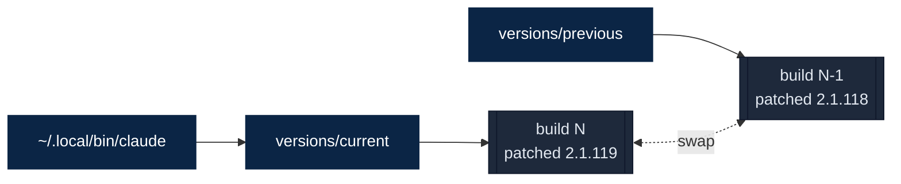
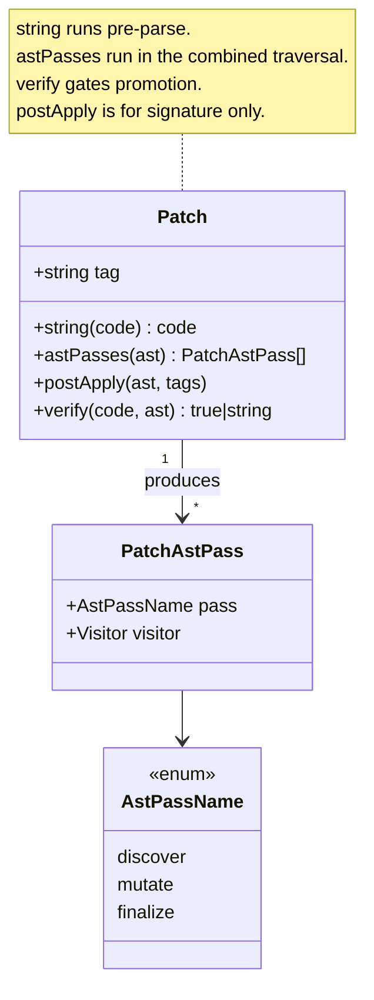

<p align="center">
  <h1 align="center">cc-enhanced</h1>
  <p align="center">AST-based patcher for customizing the Claude Code CLI</p>
</p>

<p align="center">
  <a href="LICENSE"></a>
  
  
  
  
</p>

---

cc-enhanced extracts the JavaScript bundle embedded in the Claude Code native binary, applies 27 verifiable patches through Babel AST traversal, and repacks the result in place. Every patch is a self-contained module with an independent verifier; one failure does not take down the rest. Promotion uses atomic symlinks, so rollback is one command.

Use it to unlock capabilities the CLI ships with but does not expose, fix long-standing bugs (shell quoting, LSP fan-out, worktree permissions), swap tool parameters for more ergonomic alternatives (`bat`-style ranges on Read, batched `edits[]` on Edit, output tails on Bash), and replace prompt fragments that steer the model toward better shell tooling.

> [!NOTE]
> This tool patches your local copy of the Claude Code binary. It does not distribute Anthropic source code. All modifications happen on your machine.

## How It Works


Prompt-only edits run first as string transforms. Everything structural shares a single Babel traversal (`discover` -> `mutate` -> `finalize`) over the 16 MB bundle, so every AST patch sees the same parse. Each patch ships its own verifier; one failure is reported and the rest still apply. The repacked JavaScript goes back into the ELF container at the exact original byte length, so nothing downstream of the bundle is disturbed.

## Quick Start

```bash
pnpm install

# Fetch latest upstream, patch it, and promote the result to active.
mise run native:update

claude --version
# 2.1.119 (Claude Code; patched: shell-quote-fix, bash-prompt, ..., signature)

mise run status
# Shows current, previous, and cached versions.
```

Rollback is a symlink swap, not a reinstall. `mise run native:rollback` exchanges the `current` and `previous` pointers atomically; the prior build stays on disk until it rotates out of the cache.



## Patches

Each patch has a short tag. Include or exclude any subset via environment variables:

```bash
CLAUDE_PATCHER_INCLUDE_TAGS=read-bat,limits,edit-extended mise run native:update
CLAUDE_PATCHER_EXCLUDE_TAGS=tools-off,agents-off           mise run native:update
```

### Tooling

Changes to built-in tools (Read, Edit, Bash, LSP, Task, MCP).

| Patch | Effect |
|-------|--------|
| [`read-bat`](src/patches/read-bat.ts) | Read replaces `offset`/`limit` with a single `range` string (`30:40`, `-30:`, `50:+20`, `100::10`, `30:40:2`), renders text through `bat` with line numbers, adds `show_whitespace: true` to reveal tabs/spaces/newlines, auto-tails `*.output` files to `-500:` when `range` is omitted, previews the first 200 lines of oversized files, and caps changed-file reminder snippets at a bounded head-plus-tail summary. |
| [`edit-extended`](src/patches/edit-extended.ts) | Edit accepts batched changes via `edits[]` and keeps them intact through validation, call dispatch, diff rendering, and transcript cleanup. The tool-use chip surfaces `batch(N)` for `edits[]` and `replace_all` when those fields are set. Prompt guidance covers when to prefer Edit over `sd`/`sg`/Write, fuzzy-match recovery, and multi-site refactors. |
| [`bash-tail`](src/patches/bash-tail.ts) | Bash gains `output_tail: boolean` (keep the last N characters on truncation, for build/test output where failures land at the end) and `max_output: number` (raise the inline threshold up to 500K chars). The tool-use chip surfaces `background`, `tail`, and `max_output: N` when those flags are set. Prompt text calls out when to use each. |
| [`tools-off`](src/patches/tools-off.ts) | Disables `Glob`, `Grep`, `WebSearch`, `WebFetch`, and `NotebookEdit`, and strips their references from prompts, tool tables, and agent frontmatter. The model is steered toward `rg`/`fd`/`bat`/`sg` for the same work. |
| [`shell-quote-fix`](src/patches/shell-quote-fix.ts) | Bash no longer mangles `!` in negation (`!x`, `!==`), shell tests (`[ ! -f ]`), or literal banged strings. Fixes real-world breakage on `-c` invocations. |
| [`mcp-server-name`](src/patches/mcp-server-name.ts) | MCP server-name validation accepts the plugin-style form (`plugin:<plugin>:<key>`) alongside the legacy alphanumeric form, so settings entries stop silently dropping at schema parse time. |
| [`taskout-ext`](src/patches/taskout-ext.ts) | TaskOutput response exposes structured `<output_file>` and `<output_filename>` fields, and the prompt instructs the model to tail the file first (`range "-500:"`) and chunk forward rather than re-reading the whole transcript. |
| [`lsp-multi-server`](src/patches/lsp-multi-server.ts) | File lifecycle notifications (`didOpen`/`didChange`/`didSave`/`didClose`) fan out to every language server registered for a file extension. Stacked setups (TypeScript + ESLint + Tailwind) stay in sync. |
| [`lsp-workspace-symbol`](src/patches/lsp-workspace-symbol.ts) | `workspaceSymbol` requests forward the actual query string to the server instead of sending an empty query that always returned no results. |

### System

Runtime behavior, caching, memory, and configuration.

| Patch | Effect |
|-------|--------|
| [`cache-tail-policy`](src/patches/cache-tail-policy.ts) | Widens the prompt-cache tail window, switches the system-prompt scope to global, extends one-hour cache TTL eligibility to subagent queries, and clamps the live cache-control block count so eviction behaves predictably on long sessions. |
| [`effort-max`](src/patches/effort-max.ts) | The interactive `/effort` picker offers the full `max` tier across supported models, and the ultrathink notification reports the selected tier accurately. |
| [`no-autoupdate`](src/patches/no-autoupdate.ts) | Forces the autoupdater guard to a safe stub so the patched binary is not replaced in the background. Marketplace plugin autoupdates continue to work through the same guard path. |
| [`limits`](src/patches/limits.ts) | Read keeps larger files inline. Byte ceiling 256K -> 1M, token budget 25K -> 50K (still overridable via `CLAUDE_CODE_FILE_READ_MAX_OUTPUT_TOKENS`), persistence threshold 50K -> 120K chars, per-tool result cap 100K -> 250K chars. |
| [`session-mem`](src/patches/session-mem.ts) | Session memory is controllable via `ENABLE_SESSION_MEMORY`, `ENABLE_SESSION_MEMORY_PAST`, `CC_SM_PER_SECTION_TOKENS` (default 2000), `CC_SM_TOTAL_FILE_LIMIT` (default 12000), `CC_SM_MINIMUM_MESSAGE_TOKENS_TO_INIT`, `CC_SM_MINIMUM_TOKENS_BETWEEN_UPDATE`, and `CC_SM_TOOL_CALLS_BETWEEN_UPDATES`. |
| [`sys-prompt-file`](src/patches/sys-prompt-file.ts) | Every conversation auto-appends a system prompt file when `appendSystemPrompt` is not explicitly set. Source is `CLAUDE_CODE_APPEND_SYSTEM_PROMPT_FILE`, falling back to `/etc/claude-code/system-prompt.md`. |
| [`worktree-perms`](src/patches/worktree-perms.ts) | Agent worktrees are added to the session's allowed edit surface on spawn and on resume, so Edit and Write inside a worktree do not fall back to per-file permission prompts. |

### Prompt

Prompt text sent to the model.

| Patch | Effect |
|-------|--------|
| [`bash-prompt`](src/patches/bash-prompt.ts) | Bash tool guidance points at modern CLI (`fd`, `eza`, `rg`, `sg`, `bat`, `sd`) and enables the code path that hides legacy `find`/`grep` from the tool list. |
| [`built-in-agent-prompt`](src/patches/built-in-agent-prompt.ts) | Explore is reframed as a deep codebase research agent (execution-path tracing, `file:line` citations, reuse candidates). Plan is reframed as a blueprint-producing architect with concrete sequencing and trade-offs. |
| [`claudemd-strong`](src/patches/claudemd-strong.ts) | CLAUDE.md wrapper text treats project instructions as mandatory when they apply, instead of advisory context, and pins a small always-applied baseline. |
| [`todo-use`](src/patches/todo-use.ts) | Todo guidance is compressed to a short, high-signal set of bullets. |

### Agent

Which built-in agents and commands are exposed.

| Patch | Effect |
|-------|--------|
| [`agents-off`](src/patches/agents-off.ts) | Removes `statusline-setup` and `claude-code-guide` from the built-in agent registry. Those flows move to user skills. |
| [`commands-off`](src/patches/commands-off.ts) | Removes the `/security-review` built-in slash command, leaving `/review` as the single review entry point and freeing the name for local skills to shadow. |

### UX

Terminal interface polish.

| Patch | Effect |
|-------|--------|
| [`plan-diff-ui`](src/patches/plan-diff-ui.ts) | Plan mode shows the real diff for plan-backed Edit and Write instead of "Updated plan" / "Reading Plan" placeholders, and stops hiding the preview hint or the tool-use row for plan-backed file writes. |
| [`no-collapse`](src/patches/no-collapse.ts) | Read, Search, and Grep results stay expanded in the transcript. Memory-file writes render with full path and diff instead of a generic collapsed summary. |
| [`skill-listing-ui`](src/patches/skill-listing-ui.ts) | The "Saved N skills" notification previews the first few activated skill names inline instead of showing only a count badge. |
| [`subagent-model-tag`](src/patches/subagent-model-tag.ts) | When `CLAUDE_CODE_SUBAGENT_MODEL` is set globally, Task rows omit the redundant dimmed `model: ...` label that would otherwise appear on every subagent. |

### Metadata

| Patch | Effect |
|-------|--------|
| [`signature`](src/patches/signature.ts) | `claude --version` appends `patched: <tag1>, <tag2>, ...` and the UI title bar gains a ` • patched` suffix, so the active patch set is visible at a glance. Runs after all other patches verify. |

## Configuration

### Patcher (build time)

| Variable | Purpose |
|----------|---------|
| `CLAUDE_PATCHER_INCLUDE_TAGS` | Comma-separated allowlist. Only listed patches run. |
| `CLAUDE_PATCHER_EXCLUDE_TAGS` | Comma-separated blocklist. Listed patches are skipped. |
| `CLAUDE_PATCHER_REVISION` | Override the revision string embedded in the signature. |
| `CLAUDE_PATCHER_CACHE_KEEP` | Retain extra cached builds beyond the default rotation. |

### Runtime (installed binary)

| Variable | Consumed by | Default |
|----------|-------------|---------|
| `CLAUDE_CODE_APPEND_SYSTEM_PROMPT_FILE` | [`sys-prompt-file`](src/patches/sys-prompt-file.ts) | `/etc/claude-code/system-prompt.md` |
| `CLAUDE_CODE_FILE_READ_MAX_OUTPUT_TOKENS` | [`limits`](src/patches/limits.ts) | 50000 |
| `CLAUDE_CODE_SUBAGENT_MODEL` | [`subagent-model-tag`](src/patches/subagent-model-tag.ts) | unset |
| `ENABLE_SESSION_MEMORY` | [`session-mem`](src/patches/session-mem.ts) | upstream default |
| `ENABLE_SESSION_MEMORY_PAST` | [`session-mem`](src/patches/session-mem.ts) | upstream default |
| `CC_SM_PER_SECTION_TOKENS` | [`session-mem`](src/patches/session-mem.ts) | 2000 |
| `CC_SM_TOTAL_FILE_LIMIT` | [`session-mem`](src/patches/session-mem.ts) | 12000 |
| `CC_SM_MINIMUM_MESSAGE_TOKENS_TO_INIT` | [`session-mem`](src/patches/session-mem.ts) | upstream default |
| `CC_SM_MINIMUM_TOKENS_BETWEEN_UPDATE` | [`session-mem`](src/patches/session-mem.ts) | upstream default |
| `CC_SM_TOOL_CALLS_BETWEEN_UPDATES` | [`session-mem`](src/patches/session-mem.ts) | 3 |

Do not set `DISABLE_TELEMETRY` or `CLAUDE_CODE_DISABLE_NONESSENTIAL_TRAFFIC`. They disable every server-side flag, including features this patcher relies on. Use the individual `DISABLE_ERROR_REPORTING`, `DISABLE_AUTOUPDATER`, and `DISABLE_BUG_COMMAND` switches instead.

## CLI Reference

```bash
mise run native:update                            # Fetch + patch + promote (standard workflow)
mise run native:update 2.1.119                    # Pin a specific version
mise run native:update --dry-run                  # Preview without promoting
mise run native:fetch-patch 2.1.119 --dry-run     # Fetch + patch preview for a pinned version
mise run native:promote <build-path>              # Promote an already-patched cached build
mise run native:rollback                          # Swap current and previous symlinks
mise run status                                   # Show current, previous, cached
mise run verify:patches                           # Typecheck + lint + dry-run on native target
mise run verify:anchors                           # Diff clean vs patched anchors
pnpm cli --list                                   # List available patches
pnpm test                                         # Run the test suite
```

`mise run patch` is intentionally disabled; it exists only to redirect to `native:update`. See `mise.toml` for the full task list and `pnpm cli --help` for CLI flags.

## Extending

Each patch lives in `src/patches/<tag>.ts` beside a co-located `<tag>.test.ts`. New patches register in two places: the export barrel (`src/patches/index.ts`) and the metadata record (`src/patch-metadata.ts`). The `/new-patch` skill scaffolds the full set.



Principles baked into the codebase:

- Find code by structure (string literals, property names), never by minified identifier names. They change every release.
- AST passes own all structural and behavioral change. String patches are reserved for prompt text.
- Verifiers target behavior and invariants, not expression shape.
- Target only the latest upstream. No backward-compatibility fallbacks.

## Compatibility

Current target: **Claude Code 2.1.119**. Tracks the latest upstream release and is updated with each upstream bump. Older versions are not maintained or tested; when upstream breaks a patch, it is fixed forward rather than kept backward-compatible. Run `claude --version` on the promoted binary to confirm the active target.

## Requirements

- **Node.js 24+** (managed via `mise`)
- **pnpm 10+** (via corepack)
- **Linux x86_64** (native ELF support is built in; other platforms require `node-lief`)
- A working **Claude Code** installation

Babel AST + generator over the 16 MB bundle needs roughly 10 GB of heap. `mise.toml` sets `NODE_OPTIONS=--max-old-space-size=12288` automatically, so run through `mise` or `pnpm` scripts. Raw `node`/`tsx` invocations will OOM.

## Disclaimer

This project is not affiliated with, endorsed by, or connected to Anthropic, PBC or any of its affiliates. "Claude" and "Claude Code" are trademarks of Anthropic, PBC. All other trademarks are the property of their respective owners.

This repository does not distribute the Claude Code binary or its source. Patches contain short text fragments used as match anchors for locating and replacing specific sections. The patcher operates exclusively on the end user's locally installed copy.

This tool modifies Claude Code, which may not be permitted under Anthropic's terms of service. Users are responsible for ensuring their use complies with all applicable terms and laws. The authors hold no liability for misuse, account actions, or damages resulting from this tool. Use at your own risk.

## License

[MIT](LICENSE)
