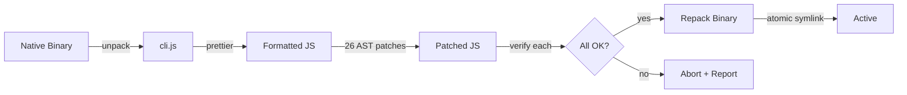
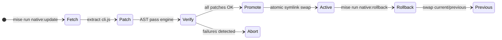
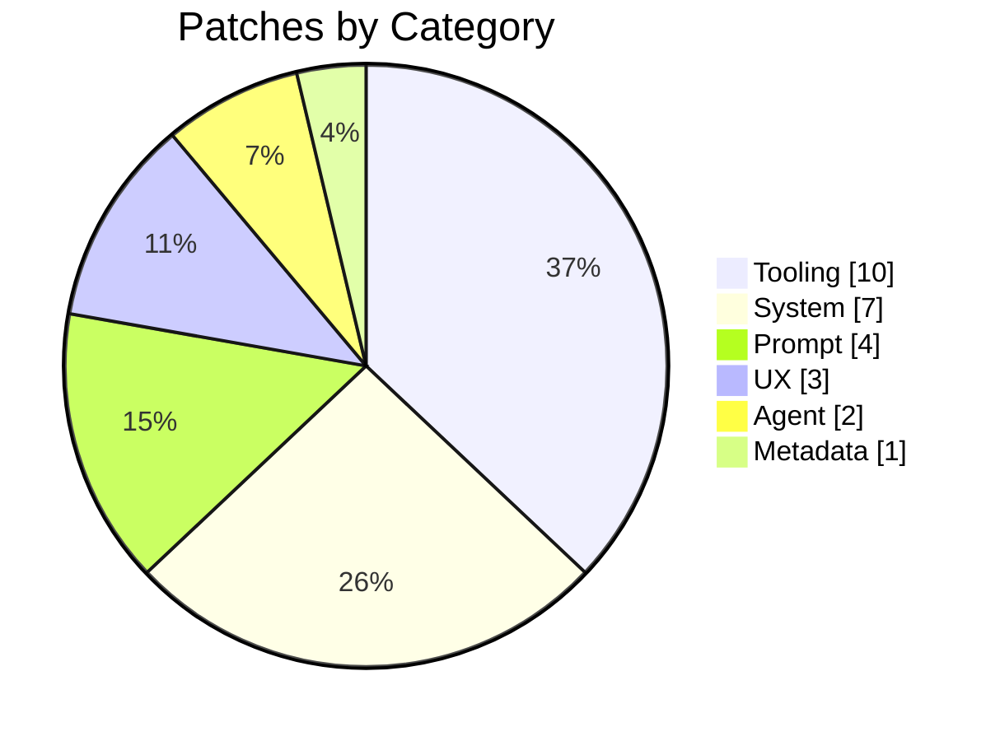

<p align="center">
  <h1 align="center">cc-enhanced</h1>
  <p align="center">AST-based patcher for customizing the Claude Code CLI</p>
</p>

<p align="center">
  <a href="LICENSE"></a>
  
  
  
</p>

---

cc-enhanced patches the Claude Code CLI binary to unlock capabilities, fix bugs, and improve the development experience. It uses Babel AST traversal to make surgical, verifiable changes to the embedded JavaScript, then repacks the native binary in place.

> [!NOTE]
> This tool patches your local copy of the Claude Code binary. It does not distribute any Anthropic source code.<br>
> All modifications happen on your machine.

## How It Works



The patcher extracts the embedded JavaScript from the Claude Code binary, applies 26 AST patches in a single optimized pass (`discover` -> `mutate` -> `finalize`), verifies each patch independently, and repacks the result. The binary stays exactly the same size through in-place bytecode replacement. Native fetches use the official release manifest and can fall back to `curl`/`wget` for large binary downloads when Node `fetch()` is unreliable.



**Rollback is instant.** Promotion uses atomic symlinks, and the previous version is always preserved.

## Quick Start

```bash
# Install dependencies
pnpm install

# Fetch latest Claude Code, patch it, and promote to active
mise run native:update

# Verify everything is working
claude --version    # Shows "patched: tag1, tag2, ..." suffix
mise run status     # Shows current/previous versions
```

## Patches

Every patch is independently verifiable and can be included or excluded:

```bash
# Include only specific patches
CLAUDE_PATCHER_INCLUDE_TAGS=read-bat,limits,edit-extended mise run native:update

# Exclude specific patches
CLAUDE_PATCHER_EXCLUDE_TAGS=tools-off,agents-off mise run native:update
```

---

### Tooling

Patches that enhance, fix, or extend Claude's built-in tools.

The tables below summarize the user-facing effect of each patch.

| Patch | What's changed |
|-------|----------------|
| `read-bat` | Read accepts `bat`-style `range` syntax (`30:40`, `-30:`, `100::10`), returns line-numbered output, tails `.output` files by default, previews oversized files with truncation notices, and keeps changed-file diff snippets bounded. |
| `edit-extended` | Edit accepts multi-edit batches through `edits[]`, preserves structured edit payloads through normalization and transcript cleanup, shows the correct diff preview for extended edits, and includes stronger guidance for fuzzy matching and recovery. |
| `bash-tail` | Bash accepts `output_tail` to preserve the end of truncated output and `max_output` to keep larger results inline up to 500K chars. |
| `limits` | Read keeps larger files inline with a 1MB byte ceiling, a 50K token budget, a 120K-char persistence threshold, and higher formatted-read output limits. |
| `tools-off` | Claude works through a Bash-centric file and search workflow without `Glob`, `Grep`, `WebSearch`, `WebFetch`, or `NotebookEdit`, and the prompt guidance points it toward the remaining shell-based toolchain. |
| `shell-quote-fix` | Bash command generation preserves literal `!` usage for negation, comparisons, and shell tests. |
| `mcp-server-name` | Settings accept MCP server names containing colons and dots, including multi-part plugin-style names. |
| `taskout-ext` | Task output metadata includes structured `output_file` and `output_filename` fields so follow-up reads can locate full background logs reliably. |
| `lsp-multi-server` | File lifecycle events fan out to every matching language server, so stacked setups like TypeScript + ESLint + Tailwind stay in sync. |
| `lsp-workspace-symbol` | `workspaceSymbol` requests carry the actual search query through the tool pipeline. |

### System

Patches that modify runtime behavior, caching, and configuration.

| Patch | What's changed |
|-------|----------------|
| `cache-tail-policy` | Prompt caching uses a two-turn tail window, user-message breakpoints, global system-prompt scope, a one-hour TTL, and a four-block cap. |
| `effort-max` | The interactive effort picker offers the full `max` tier across supported models. |
| `no-autoupdate` | The promoted patched build stays in place while marketplace plugins continue to update normally. |
| `session-mem` | Session memory behavior is controlled locally through environment variables, including enablement, past-session lookup, token caps, and update thresholds. |
| `sys-prompt-file` | Every conversation automatically appends a system prompt file from `/etc/claude-code/system-prompt.md` or a configured path. |
| `worktree-perms` | Agent worktrees automatically include their working directories in the allowed edit surface, so normal read and edit flows do not fall back to repeated permission prompts. |

### Prompt

Patches that improve or replace prompt text sent to the model.

| Patch | What's changed |
|-------|----------------|
| `bash-prompt` | Bash guidance steers the model toward modern CLI tools such as `fd`, `rg`, `bat`, `sd`, `sg`, and `eza`. |
| `built-in-agent-prompt` | Explore is framed as deep codebase research with execution-path tracing, and Plan is framed as blueprint-driven architecture work with concrete trade-offs, sequencing, and implementation guidance. |
| `claudemd-strong` | CLAUDE.md instructions are treated as binding guidance whenever they apply. |
| `todo-use` | Todo guidance stays short and high-signal with two compact usage bullets. |

### Agent

Patches that control which agents and commands are available.

| Patch | What's changed |
|-------|----------------|
| `agents-off` | The built-in agent roster omits `statusline-setup` and `claude-code-guide`, keeping setup and guidance flows in user-controlled skills and prompts. |
| `commands-off` | The slash-command surface omits `/security-review`, keeping `/review` as the single review entry point and leaving room for local skill shadowing. |

### UX

Patches that improve the terminal interface.

| Patch | What's changed |
|-------|----------------|
| `plan-diff-ui` | Plan mode shows the actual tool label and full diff content for read and write actions. |
| `no-collapse` | Read, Search, and Grep results stay expanded, and memory-file writes show their full path and diff. |
| `subagent-model-tag` | Task rows omit redundant model labels when the subagent model is already pinned globally, reducing repeated visual noise in busy sessions. |

### Metadata

| Patch | What's changed |
|-------|----------------|
| `signature` | `claude --version` and the UI title bar show that the binary is patched and expose the active patch set for quick verification. |

## Patch Distribution



Each patch is a self-contained module with an `astPasses` function (Babel visitors for the combined-pass engine), a `verify` function (returns `true` or a failure reason), and an optional `string` transform for prompt-only patches. Patches are isolated: if one fails verification, the others still apply and the failure is reported with the specific reason.

## CLI Reference

```bash
mise run native:update              # Fetch + patch + promote (standard workflow)
mise run native:update 2.1.101      # Pin a specific version
mise run native:update --dry-run    # Preview without promoting
mise run native:fetch-patch 2.1.101 --dry-run  # Fetch + patch preview for a pinned version
mise run native:promote <build-path>          # Promote an already-patched cached build
mise run native:rollback            # Instant rollback to previous version
mise run status                     # Show current/previous/cached versions
mise run verify:patches             # Full health check (typecheck + lint + dry-run)
pnpm cli --list                     # List all available patches
pnpm test                           # Run test suite
```

See `pnpm cli --help` for all options and `mise.toml` for all tasks.

## Compatibility

Tested against **Claude Code 2.1.101**. Only the latest upstream version is targeted. Older versions are not maintained or tested.

## Requirements

- **Node.js 24+** (managed via `mise`)
- **pnpm 10+** (via corepack)
- **Linux x86_64** (native ELF support built-in; macOS/Windows via optional `node-lief`)
- A working **Claude Code** installation

## Disclaimer

This project is not affiliated with, endorsed by, or connected to Anthropic, PBC or any of its affiliates. "Claude" and "Claude Code" are trademarks of Anthropic, PBC. All other trademarks are the property of their respective owners.

This repository does not distribute the Claude Code binary or its source. Patches contain short text fragments used as match anchors for locating and replacing specific sections. The patcher operates exclusively on the end user's locally installed copy.

This tool modifies Claude Code, which may not be permitted under Anthropic's terms of service. Users are responsible for ensuring their use complies with all applicable terms and laws. The authors hold no liability for misuse, account actions, or damages resulting from this tool. Use at your own risk.

## License

[MIT](LICENSE)
