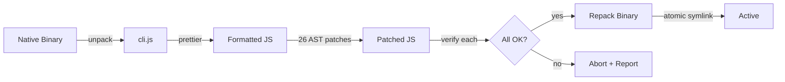
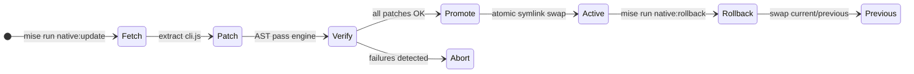
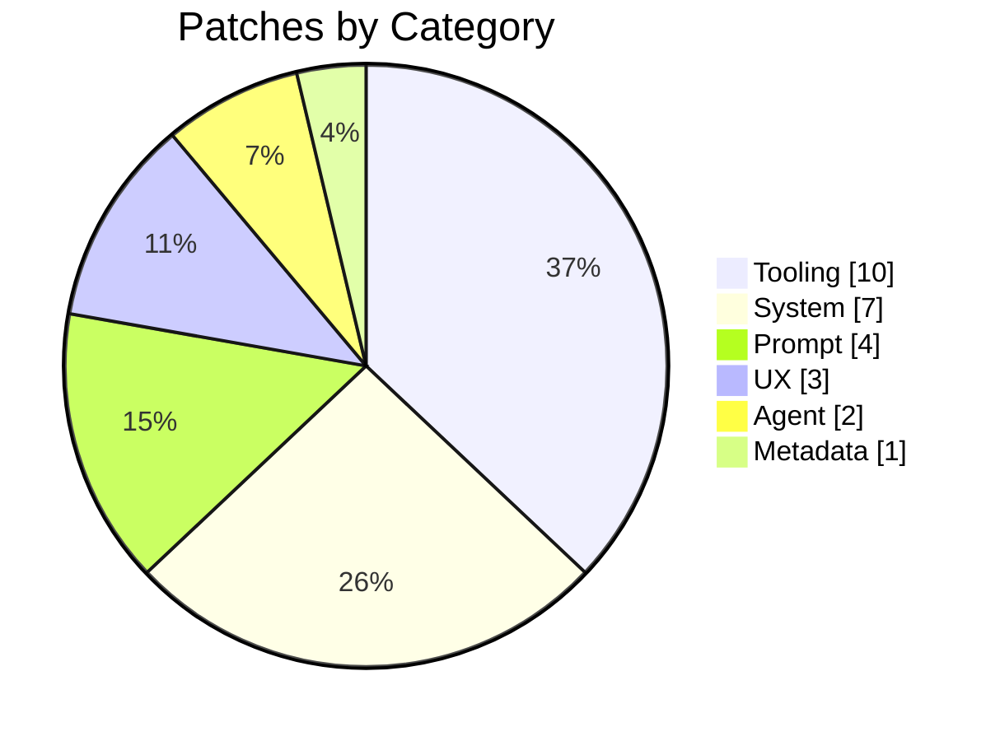

<p align="center">
  <h1 align="center">cc-enhanced</h1>
  <p align="center">AST-based patcher for customizing the Claude Code CLI</p>
</p>

<p align="center">
  <a href="LICENSE"></a>
  
  
  
</p>

---

cc-enhanced patches the Claude Code CLI binary to unlock capabilities, fix bugs, and improve the development experience. It uses Babel AST traversal to make surgical, verifiable changes to the embedded JavaScript, then repacks the native binary in place.

> [!NOTE]
> This tool patches your local copy of the Claude Code binary. It does not distribute any Anthropic source code. All modifications happen on your machine. You need a valid Claude Code subscription.

## How It Works



The patcher extracts the embedded JavaScript from the Claude Code binary, applies 26 AST patches in a single optimized pass (`discover` -> `mutate` -> `finalize`), verifies each patch independently, and repacks the result. The binary stays exactly the same size through in-place bytecode replacement.



**Rollback is instant.** Promotion uses atomic symlinks, and the previous version is always preserved.

## Quick Start

```bash
# Install dependencies
pnpm install

# Fetch latest Claude Code, patch it, and promote to active
mise run native:update

# Verify everything is working
claude --version    # Shows "patched: tag1, tag2, ..." suffix
mise run status     # Shows current/previous versions
```

## Patches

Every patch is independently verifiable and can be included or excluded:

```bash
# Include only specific patches
CLAUDE_PATCHER_INCLUDE_TAGS=read-bat,limits,edit-extended mise run native:update

# Exclude specific patches
CLAUDE_PATCHER_EXCLUDE_TAGS=tools-off,agents-off mise run native:update
```

---

### Tooling

Patches that enhance, fix, or extend Claude's built-in tools.

| Patch | What it does |
|-------|-------------|
| `read-bat` | Replaces Read tool with `bat`-style range syntax (`30:40`, `-30:`, `100::10`), line-numbered output, auto-tailing for `.output` files, and oversized file preview with truncation notice. Caps changed-file diff snippets to prevent context bloat. |
| `edit-extended` | Adds batch edit mode (`edits[]` for multiple find/replace in one call), rewrites the Edit prompt with fuzzy matching docs and error recovery tips, and fixes the diff preview for extended edits. |
| `bash-tail` | Adds `output_tail` parameter (keeps the last N characters of truncated output so build errors are visible) and `max_output` (overrides inline threshold up to 500K to avoid disk saves). |
| `limits` | Raises Read tool caps: byte ceiling 256KB to 1MB, token budget 25K to 50K, persistence threshold 50K to 120K chars. Formatted reads up to ~30K tokens stay inline instead of being saved to disk. |
| `tools-off` | Disables Glob, Grep, WebSearch, WebFetch, and NotebookEdit so Claude uses Bash-based alternatives. Rewrites all prompt references to stop recommending disabled tools. |
| `shell-quote-fix` | Fixes a bug where `!` in Bash commands (negation, `!==`, shell tests) was incorrectly backslash-escaped, corrupting generated commands. |
| `mcp-server-name` | Fixes MCP server name validation so names with colons and dots (like `plugin:name:key`) are accepted in settings, instead of silently rejecting the settings file. |
| `taskout-ext` | Adds structured `output_file` and `output_filename` fields to TaskOutput so Claude can reliably find and read full background task output. |
| `lsp-multi-server` | Fixes LSP so file events are sent to all registered language servers for a file type, not just the first. Enables TypeScript + ESLint + Tailwind working simultaneously. |
| `lsp-workspace-symbol` | Fixes `workspaceSymbol` to pass through the search query instead of always sending an empty string. |

### System

Patches that modify runtime behavior, caching, and configuration.

| Patch | What it does |
|-------|-------------|
| `cache-tail-policy` | Optimizes API prompt caching: extends tail window to 2 turns, restricts breakpoints to user messages, promotes system prompt to global cache scope for cross-conversation hits, ensures 1-hour TTL, and caps cache blocks at 4. |
| `effort-max` | Unlocks "max" effort level in the interactive picker for all models, not just Opus. |
| `no-autoupdate` | Prevents Claude Code from silently replacing itself with a newer version (which would undo patches), while keeping plugin marketplace updates working. |
| `session-mem` | Makes session memory controllable via environment variables (`ENABLE_SESSION_MEMORY`, `ENABLE_SESSION_MEMORY_PAST`) regardless of server-side flags. Token caps and update thresholds become configurable. |
| `sys-prompt-file` | Loads a system prompt from `/etc/claude-code/system-prompt.md` (or a custom path via env var) and appends it to every conversation automatically. |
| `worktree-perms` | Fixes agent worktree permissions by adding the worktree path to `additionalWorkingDirectories`. Without this, every Edit/Write in an agent worktree triggers a permission prompt even in `acceptEdits` mode. |

### Prompt

Patches that improve or replace prompt text sent to the model.

| Patch | What it does |
|-------|-------------|
| `bash-prompt` | Replaces legacy tool guidance so Claude recommends modern CLI tools (`fd`, `rg`, `bat`, `sd`, `sg`, `eza`) instead of `find`, `grep`, `cat`, `sed`, `awk`. |
| `built-in-agent-prompt` | Rewrites Explore and Plan agent prompts. Explore becomes a deep codebase researcher with execution path tracing. Plan becomes a senior architect delivering concrete blueprints with trade-off analysis. |
| `claudemd-strong` | Replaces the weak CLAUDE.md disclaimer with mandatory enforcement, making CLAUDE.md instructions binding when applicable. |
| `todo-use` | Condenses verbose Todo tool examples to two brief bullets, reducing prompt token overhead. |

### Agent

Patches that control which agents and commands are available.

| Patch | What it does |
|-------|-------------|
| `agents-off` | Disables the `statusline-setup` and `claude-code-guide` built-in agents. |
| `commands-off` | Disables `/pr-comments`, `/review`, and `/security-review` slash commands, superseded by custom skills and dedicated agents with better functionality. |

### UX

Patches that improve the terminal interface.

| Patch | What it does |
|-------|-------------|
| `plan-diff-ui` | Shows actual "Write"/"Read" labels and full diffs in plan mode instead of generic "Updated plan" with suppressed content. |
| `no-collapse` | Stops the UI from collapsing Read/Search/Grep results into one-line summaries. Makes memory file writes visible with full path and diff. |
| `subagent-model-tag` | Hides the redundant model name on Task subagent rows when the subagent model is globally pinned. |

### Metadata

| Patch | What it does |
|-------|-------------|
| `signature` | Appends a "patched: tag1, tag2, ..." marker to `claude --version` and a " * patched" indicator to the UI title bar. |

## Patch Distribution



Each patch is a self-contained module with an `astPasses` function (Babel visitors for the combined-pass engine), a `verify` function (returns `true` or a failure reason), and an optional `string` transform for prompt-only patches. Patches are isolated: if one fails verification, the others still apply and the failure is reported with the specific reason.

## CLI Reference

```bash
mise run native:update              # Fetch + patch + promote (standard workflow)
mise run native:update 2.1.90       # Pin a specific version
mise run native:update --dry-run    # Preview without promoting
mise run native:rollback            # Instant rollback to previous version
mise run status                     # Show current/previous/cached versions
mise run verify:patches             # Full health check (typecheck + lint + dry-run)
pnpm cli --list                     # List all available patches
pnpm test                           # Run test suite
```

See `pnpm cli --help` for all options and `mise.toml` for all tasks.

## Compatibility

Tested against **Claude Code 2.1.88**. Only the latest upstream version is targeted. Older versions are not maintained or tested.

## Requirements

- **Node.js 24+** (managed via `mise`)
- **pnpm 10+** (via corepack)
- **Linux x86_64** (native ELF support built-in; macOS/Windows via optional `node-lief`)
- A working **Claude Code** installation

## Disclaimer

This project is not affiliated with, endorsed by, or connected to Anthropic, PBC or any of its affiliates. "Claude" and "Claude Code" are trademarks of Anthropic, PBC. All other trademarks are the property of their respective owners.

This repository does not distribute the Claude Code binary or its source. Patches contain short text fragments used as match anchors for locating and replacing specific sections. The patcher operates exclusively on the end user's locally installed copy.

This tool modifies Claude Code, which may not be permitted under Anthropic's terms of service. Users are responsible for ensuring their use complies with all applicable terms and laws. The authors hold no liability for misuse, account actions, or damages resulting from this tool. Use at your own risk.

## License

[MIT](LICENSE)
