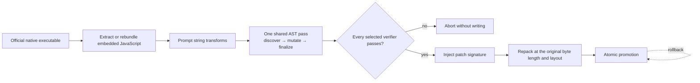

<h1 align="center">cc-enhanced</h1>

<p align="center"><strong>Verifiable AST patches for the latest Claude Code native CLI</strong></p>

<p align="center">
  <a href="https://github.com/camjac251/cc-enhanced/actions/workflows/ci.yml"></a>
  
  
  
  <a href="LICENSE"></a>
</p>

<p align="center">
  <a href="docs/getting-started.md">Get started</a> ·
  <a href="docs/patches.md">Patch catalog</a> ·
  <a href="docs/configuration.md">Configuration</a> ·
  <a href="docs/target-workflows.md">Desktop and remote targets</a> ·
  <a href="docs/README.md">Documentation</a>
</p>

cc-enhanced extracts the JavaScript embedded in an official Claude Code native executable, rebundles split modules into one patch surface when needed, applies a selected set of independently verifiable patches, and repacks the result without changing the native file's fixed layout. The primary `cli-full` profile improves Read and Edit ergonomics, modernizes prompt and tool routing, unlocks runtime and UI controls, and keeps the patched installation recoverable through atomic promotion and rollback.

> [!IMPORTANT]
>
> This repository contains patch source and build tooling only. It does not publish or redistribute Claude Code binaries, application bundles, container images, npm packages, credentials, session state, or generated private evidence.

## What it changes

| Area | Highlights |
| --- | --- |
| Read and Edit | `bat`-style Read ranges, whitespace rendering, batched `edits[]`, safer content-addressed edits, and structured diff presentation. |
| Tool policy | Optional removal of legacy built-ins, modern shell and MCP routing, preserved `NotebookEdit` support for Desktop-oriented candidates, and clearer task-output handling. |
| Prompt harness | Stronger repository policy, focused agent roles, current code-search guidance, model routing metadata, and prompt-surface drift checks. |
| Runtime | Cache policy, larger file limits, feature gates, model catalogs and aliases, session controls, and update protection. |
| Terminal UX | Visible patch signatures, expanded results, plan diffs, queued follow-ups, skill and agent notices, and configurable file links. |
| Native lifecycle | Official artifact fetching, split-module rebundling, fixed-layout repacking, receipt-bound verification, atomic promotion, rollback, and guarded cross-platform candidate workflows. |

The complete behavior and source link for every tag lives in the [45-patch catalog](docs/patches.md).

## Quick start

```bash
mise install
bun install --frozen-lockfile

mise run native:update

claude --version
mise run status
```

`native:update` fetches the current official release, builds and verifies a separate candidate, and promotes it only after all selected patch gates pass. Rollback is an atomic symlink exchange:

```bash
mise run native:rollback
```

See [Getting started](docs/getting-started.md) for requirements, patch selection, runtime tooling, traffic settings, and verification levels.

## How it works


```mermaid
flowchart LR
    upstream["Official native executable"] --> extract["Extract or rebundle embedded JavaScript"]
    extract --> prompts["Prompt string transforms"]
    prompts --> ast["One shared AST pass<br/>discover → mutate → finalize"]
    ast --> verify{"Every selected verifier passes?"}
    verify -- no --> abort["Abort without writing"]
    verify -- yes --> signature["Inject patch signature"]
    signature --> repack["Repack at the original byte length and layout"]
    repack --> promote["Atomic promotion"]
    promote -. rollback .-> promote
```

Structural patches share one parsed AST and run in registration order. Each patch owns its verifier, failed tags are reported together, and no artifact is written when any required verification fails. Native lifecycle operations are serialized by a process-tree lease because bundle parsing, repacking, prompt export, and full verification are memory-heavy.

## Profiles and target surfaces

| Surface | Patch policy | Selection state | What is still required |
| --- | --: | --- | --- |
| Standalone CLI (`cli-full`) | 45 registered patches | Supported and selectable | A real latest-bundle verification before release or promotion claims. |
| Desktop-local | 31 probe-required candidates, 15 exclusions | Reserved and build-only | Exact target receipts plus stock and patched Read/Edit/tool approval and presentation probes. |
| Remote Control | 31 probe-required candidates, 15 exclusions | Reserved and build-only | Matching-host proof and separate web, mobile, and Desktop client compatibility evidence. |
| Self-hosted runner | 31 probe-required candidates, 15 exclusions | Reserved and build-only | Runner registration, child execution, deployment, and client qualification. |

> [!NOTE]
>
> The target work did not remove or minimize the CLI patch roster. `cli-full` remains the exact ordered 45-patch profile. The surface catalog contains one additional profile-only `tools-off-desktop` variant, making 46 classified entries for Desktop, Remote Control, and self-hosted planning.

Offline construction, matching-host execution, stock-client rendering, and live control-plane operation are separate proof levels. A passing earlier level never promotes a reserved profile or establishes later compatibility. The [target workflow guide](docs/target-workflows.md) explains the commands, client UI risks, Remote Control path, self-hosted path, and upkeep model.

## Documentation

| Guide | Use it for |
| --- | --- |
| [Getting started](docs/getting-started.md) | Install, patch, activate, select tags, verify, and roll back. |
| [Patch catalog](docs/patches.md) | Review every registered patch and its exact effect. |
| [Configuration](docs/configuration.md) | Configure patch selection, prompt policy, models, file opening, and runtime controls. |
| [CLI and inspection reference](docs/cli-reference.md) | Run lifecycle, prompt export, bundle inspection, evidence, and release-diff commands. |
| [Target workflows](docs/target-workflows.md) | Build or assess Desktop, Remote Control, and self-hosted candidates without overstating support. |
| [Subscription routing](docs/subscription-routing/README.md) | Maintain the optional direct-plus-mixed-model launcher setup. |
| [Maintainer reference](docs/maintainer-reference.md) | Understand binary formats, patch interactions, release procedures, prompt drift, and authoring rules. |

## Development and verification

```bash
bun run docs:check
bun run typecheck
bun run lint
bun run test
mise run verify:patches
```

`bun run test` deliberately executes one test file at a time to bound memory. Fixture tests validate contracts and edge cases; only `mise run verify:patches` against a real native bundle proves that the current upstream release still matches and verifies. See the [CLI reference](docs/cli-reference.md) for prompt exports, matrix checks, and release-diff tooling.

## Distribution and safety

- Generated candidates and evidence belong under ignored repository-local cache paths or another explicit private location.
- CI installs dependencies, checks documentation, typechecks, lints, and runs the serial test suite; it does not upload release assets or patched builds.
- Desktop-managed artifacts are not mutated by the offline candidate builder.
- Remote Control and self-hosted live actions remain explicit, receipt-bound operations with their own trust and consent gates.

## Disclaimer

This project is not affiliated with, endorsed by, or connected to Anthropic, PBC or any of its affiliates. "Claude" and "Claude Code" are trademarks of Anthropic, PBC. This tool modifies a locally obtained Claude Code executable, which may not be permitted under applicable terms. Users are responsible for their own compliance and use it at their own risk.

## License

[MIT](LICENSE)
