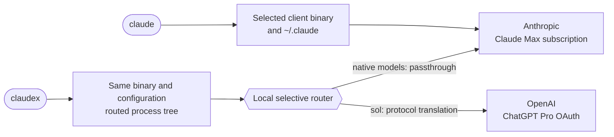

# Subscription routing setup

This package reproduces a two-subscription setup without placing provider API
keys in the client configuration:



The direct and routed launchers intentionally coexist. `claude` remains the
baseline. `claudex` adds routing only for that process tree, including fresh
agents and workflow workers. It does not replace the normal login, settings,
status line, plugins, skills, agents, session history, or project configuration.

Two client profiles are supported:

- **Enhanced client:** the current cc-enhanced build owns all client changes and
  exposes the complete model catalog, picker, context, prompt, agent, and
  workflow behavior.
- **Stock client:** an official Claude Code installation uses Clodex's own
  client patch for first-class routed aliases in `/model`, Agent, and Workflow
  calls. The routing wrapper and system-prompt propagation are otherwise the
  same. A completely untouched stock binary can route a top-level canonical
  model ID, but it does not provide the full `model: "sol"` experience and is
  not the documented stock profile.

The package targets WSL or Linux x86_64 with a systemd user session. Clodex is
portable to other platforms, but the supplied service and PasswordVault bridge
are platform-specific.

## Updates

Clodex is a globally activated mise npm tool. Install it once with `mise use
-g`, then update it with `mise upgrade`.

This directory is the source of truth for the setup behavior and templates.
Use it in place so rendering and verification use the same files. Removing the
source checkout does not alter the installed launchers, service, globally
activated Clodex tool, or account state.

The current translated-model configuration uses a 258,400-token effective
input window with a 32,000-token output allowance. This package does not enable
the separate 372K-context experiment or claim a one-million-token
translated-model window. The routing catalog retains the provider's raw
272,000-token route window, so `clodex models` may display `272K context`. The
launcher deliberately advertises the reviewed 258,400-token effective input
limit to the client; these values describe different layers and are not
configuration drift.

## File map

| Path | Purpose |
| --- | --- |
| `README.md` | Installation, operation, update, rollback, and removal guide |
| `test-service-control.sh` | Isolated ordering and failure tests for the restart guard and controller |
| `test-client-compatibility.sh` | Isolated checks for enhanced and stock client ownership, verifier profile routing, and parent and subagent prompt propagation |
| `verify-static.sh` | Read-only common setup verification with enhanced-default patch checks plus an explicit stock profile |
| `verify-live.sh` | Profile-aware service and authentication verification with optional inference smoke tests |
| `templates/claudex` | Routed session launcher |
| `templates/clodex` | Isolated provider-administration wrapper |
| `templates/claudex-process-wrapper` | Portable process wrapper that applies the reviewed prompt to initial and child Claude Code processes before routing them |
| `templates/clodex-service` | Guarded service restart and readiness controller |
| `templates/claudex-clodex.service` | Hardened on-demand systemd user service |
| `templates/claudex-credential-helper` | WSL-to-Windows secure-store bridge |
| `templates/claudex-credential-helper.ps1` | Windows PasswordVault implementation |
| `templates/system-prompt-routing.md` | Routed model, workflow, and delegation policy |

Do not add generated checkouts, deployed runtimes, configuration databases,
logs, certificates, account identifiers, credential payloads, home paths, or
host-specific network settings to this directory.

## Ownership boundaries

In the enhanced profile, the cc-enhanced patcher owns the native binary, patch
signature, model catalog, aliases, context metadata, model-picker behavior,
agent model tags, prompt policy, and workflow lifecycle guards. The
administration wrapper detects that signature and rejects `clodex patch`.

In the stock profile, Clodex is the only client patch owner. Its patch builds
the routed model map from the saved favorites and aliases, adds those values to
the client model surfaces, and records a per-version patch manifest under the
isolated Clodex home. Run it again after every stock Claude Code update or
routed-model configuration change.

Clodex owns selective transport, provider authentication, protocol translation,
model discovery, credential refresh, and lifecycle logging.

Never let both patch managers target the same native binary. The supplied
administration wrapper enforces that boundary for the enhanced profile while
allowing `clodex patch` for a stock client.

## Enhanced-client capabilities

The promoted client must report all of these tags:

- `claude-api-scope`
- `configured-model-catalog`
- `billing-label`
- `model-aliases`
- `model-context-metadata`
- `model-picker-session-only`
- `skill-listing-ui`
- `subagent-model-tag`
- `subagent-system-prompt`
- `sys-prompt-file`
- `workflow-safety`

`workflow-safety` is required. It prevents ordinary agent messaging from
resuming workflow-owned workers, persists workflow ownership before launch,
fails closed when ownership metadata cannot be read, and supplies a targeted
correction when structured output fields are embedded in one string.

`claude-api-scope` is required. It keeps the built-in API reference skill
available for applications that call the Anthropic API or SDK while preventing
client, transcript, workflow, routing, and proxy work from activating it merely
because those tasks mention Claude.

`skill-listing-ui` is required. Agent and workflow forks discard inherited
skill-listing attachments before adding the current listing, so a resumed
session cannot keep obsolete skill descriptions after a client update.

`subagent-system-prompt` is required in the enhanced profile. It propagates the
resolved append prompt into fresh Agent and Workflow children, including
launches that did not explicitly supply the hidden native subagent prompt
option.

The stock profile does not depend on that cc-enhanced tag. The portable process
wrapper supplies Claude Code's native `--append-system-prompt-file` and
`--append-subagent-system-prompt` options explicitly on each process launch.
Clodex's stock-client patch supplies the separate model-schema, picker, alias,
and context behavior.

## Prerequisites

Install:

- Git;
- [mise](https://mise.jdx.dev/);
- a systemd user session;
- common POSIX utilities;
- `sed`, `grep`, `cmp`, and `flock`;
- `jq` for lifecycle-log inspection;
- Windows PowerShell and `wslpath` only when using the supplied WSL
  PasswordVault helper.

The client source manages its Bun toolchain. Node.js and Clodex are ordinary
globally activated mise tools.

## 1. Select a client profile

### Enhanced client

Start from the parent directory where you want the source checkout:

```sh
(
set -eu

git clone \
  --branch main \
  --single-branch \
  https://github.com/camjac251/cc-enhanced.git \
  cc-enhanced

cd cc-enhanced
mise install
mise run native:update -- latest

claude --version
mise run status
)
```

The update performs the real-bundle patch verification, promotes by atomic
symlink replacement, exports the promoted prompts, and checks both curated
prompt surfaces and prompt drift. A failed patch verification does not write or
promote the candidate.

### Stock client

Keep the official `claude` command installed and confirm it works directly:

```sh
claude --version
claude
```

Do not install cc-enhanced over that binary. Complete the Clodex, credential,
wrapper, prompt, and model-selection sections below, then run `clodex patch` as
described in section 6. The stock profile does not use the cc-enhanced patch-tag
checks.

## 2. Install Clodex globally with mise

```sh
mise use -g node@lts
mise use -g --minimum-release-age 0 npm:@bman654/clodex@latest
mise tool npm:@bman654/clodex
mise which clodex
mise which clodex-claude
```

`mise use -g` installs Node.js and Clodex in the global mise configuration, so
`clodex` and `clodex-claude` are available anywhere mise is activated.
`--minimum-release-age 0` opts this tool out of a global release-age delay; omit
it if waiting for newly published releases is intentional.

The setup templates record the paths reported by `mise which`.

## 3. Select and install a credential helper

The helper contract is:

```text
helper get <service> <account>
helper set <service> <account>    # value arrives on stdin
helper delete <service> <account>
```

`get` writes the exact stored value to stdout. A missing item exits 2. Other
failures exit nonzero without writing a credential.

For WSL with Windows PasswordVault:

```sh
(
set -eu

install -d -m 700 "$HOME/.local/libexec"
install -m 700 templates/claudex-credential-helper \
  "$HOME/.local/libexec/claudex-credential-helper"
install -m 600 templates/claudex-credential-helper.ps1 \
  "$HOME/.local/libexec/claudex-credential-helper.ps1"
)
```

The helper chunks values that exceed PasswordVault's per-record limit,
publishes a generation only after every chunk is written, validates a digest
when reading, and removes superseded generations after a successful commit.

For native Linux or macOS, provide an equivalent executable backed by Secret
Service, KWallet, Keychain, `pass`, or another secure store:

```sh
export CLODEX_CREDENTIAL_HELPER_PATH=/absolute/path/to/secure-helper
```

Use the same absolute value during template rendering and every verification
run. Do not use a plaintext token file.

## 4. Render the service and launchers

This example defaults to the supplied WSL helper but accepts the absolute
`CLODEX_CREDENTIAL_HELPER_PATH` override:

```sh
(
set -eu

node_bin=$(mise which node)
clodex_bin=$(mise which clodex)
clodex_wrapper=$(mise which clodex-claude)
claude_bin=$(command -v claude)
credential_helper=${CLODEX_CREDENTIAL_HELPER_PATH:-"$HOME/.local/libexec/claudex-credential-helper"}
launcher_process_wrapper="$HOME/.local/libexec/claudex-process-wrapper"

case "$credential_helper" in
  /*) ;;
  *) printf '%s\n' 'credential helper path must be absolute' >&2; exit 1 ;;
esac
test -x "$node_bin"
test -x "$clodex_bin"
test -x "$clodex_wrapper"
test -x "$claude_bin"
test -x "$credential_helper"

if ! systemctl --user is-active --quiet claudex-clodex.service; then
  "$node_bin" - 3457 <<'NODE'
const net = require('node:net');
const port = Number(process.argv[2]);
const server = net.createServer();
server.once('error', error => {
  process.stderr.write(`port ${port} is unavailable: ${error.message}\n`);
  process.exitCode = 1;
});
server.listen({ host: '127.0.0.1', port, exclusive: true }, () => server.close());
NODE
fi

rendered_dir=$(mktemp -d)
trap 'rm -rf "$rendered_dir"' 0 HUP INT TERM

sed \
  -e "s|@HOME@|$HOME|g" \
  -e "s|@NODE_BIN@|$node_bin|g" \
  -e "s|@CLODEX_BIN@|$clodex_bin|g" \
  -e "s|@CLODEX_CREDENTIAL_HELPER@|$credential_helper|g" \
  templates/claudex-clodex.service >"$rendered_dir/claudex-clodex.service"
sed \
  -e "s|@NODE_BIN@|$node_bin|g" \
  -e "s|@CLODEX_BIN@|$clodex_bin|g" \
  -e "s|@CLAUDE_BIN@|$claude_bin|g" \
  -e "s|@CLODEX_CREDENTIAL_HELPER@|$credential_helper|g" \
  templates/clodex >"$rendered_dir/clodex"
sed \
  -e "s|@NODE_BIN@|$node_bin|g" \
  -e "s|@CLODEX_BIN@|$clodex_bin|g" \
  -e "s|@CLODEX_CLAUDE_BIN@|$clodex_wrapper|g" \
  templates/clodex-service >"$rendered_dir/clodex-service"
sed \
  -e "s|@NODE_BIN@|$node_bin|g" \
  -e "s|@CLODEX_CLAUDE_BIN@|$clodex_wrapper|g" \
  templates/claudex-process-wrapper >"$rendered_dir/claudex-process-wrapper"
sed \
  -e "s|@NODE_BIN@|$node_bin|g" \
  -e "s|@CLAUDE_BIN@|$claude_bin|g" \
  -e "s|@CLODEX_CLAUDE_BIN@|$clodex_wrapper|g" \
  -e "s|@CLAUDEX_PROCESS_WRAPPER@|$launcher_process_wrapper|g" \
  -e "s|@CLODEX_CREDENTIAL_HELPER@|$credential_helper|g" \
  templates/claudex >"$rendered_dir/claudex"

install -d -m 700 "$HOME/.local/share/claudex-clodex"
install -d -m 700 \
  "$HOME/.config/systemd/user" \
  "$HOME/.local/bin" \
  "$HOME/.local/libexec"
install -m 600 "$rendered_dir/claudex-clodex.service" \
  "$HOME/.config/systemd/user/claudex-clodex.service"
install -m 700 "$rendered_dir/claudex" "$HOME/.local/bin/claudex"
install -m 700 "$rendered_dir/clodex" "$HOME/.local/bin/clodex"
install -m 700 "$rendered_dir/clodex-service" "$HOME/.local/bin/clodex-service"
install -m 700 "$rendered_dir/claudex-process-wrapper" \
  "$launcher_process_wrapper"

systemctl --user daemon-reload
)
```

The unit stays disabled. `claudex` starts it on demand and waits up to ten
seconds for the strict process-wrapper readiness check. `claude` does not start
or depend on the service.

The service clears provider API keys, alternate provider base URLs, and routing
overrides. Optional proxy or private-CA settings belong in:

```text
~/.config/claudex-clodex/network.env
```

The file is service-only, mode 600, and may contain values such as
`HTTPS_PROXY`, `NO_PROXY`, or `NODE_EXTRA_CA_CERTS`. Do not put provider API
keys in it.

## 5. Render the routed prompt

The routed prompt is the managed `/etc/claude-code/system-prompt.md`, when
present, plus the routing-specific policy:

```sh
(
set -eu

prompt_directory="$HOME/.config/claudex-clodex"
install -d -m 700 "$prompt_directory"
temporary_prompt=$(mktemp "$prompt_directory/.system-prompt.XXXXXX")
trap 'rm -f "$temporary_prompt"' 0 HUP INT TERM

if [ -r /etc/claude-code/system-prompt.md ]; then
  cp /etc/claude-code/system-prompt.md "$temporary_prompt"
else
  : >"$temporary_prompt"
fi
printf '\n' >>"$temporary_prompt"
sed -n 'p' templates/system-prompt-routing.md >>"$temporary_prompt"
chmod 600 "$temporary_prompt"
mv -f "$temporary_prompt" "$prompt_directory/system-prompt.md"
)
```

Rerun this block whenever the managed system prompt or routing template
changes. The static verifier reconstructs the expected file byte-for-byte.

The routed prompt is an append-only model-routing layer, not a replacement for
Claude Code's other managed policy. It must be readable by the launcher,
contain no credentials or account identifiers, and remain valid in both parent
and child contexts. The portable process wrapper adds the file to the initial
process and passes the same text through Claude Code's native subagent prompt
option. If a child launches another child, the wrapper preserves that chain
without adding the same role twice.

The policy does not force all children to `sol`. It teaches the parent that
explicit requests such as “use Sol agents” mean per-call `model: "sol"`,
preserves specialist agent types, and keeps each worker within its own context
budget.

## 6. Start, authenticate, and select the model

Start the service after the global Clodex tool and rendered unit are installed:

```sh
systemctl --user start claudex-clodex.service
clodex providers auth openai
clodex providers list
clodex models
```

In the model manager:

1. Favorite `gpt-5.6-sol` from provider `openai-oauth`.
2. Save the lowercase alias `sol`.

For the enhanced profile, stop here. The administration wrapper rejects
`clodex patch` because cc-enhanced already owns the binary.

For the stock profile, apply Clodex's model patch after saving the favorite and
alias:

```sh
clodex patch
```

Run that command again after every stock Claude Code update or after changing
the routed favorites or aliases. Clodex restores its pristine per-version
backup before rebuilding a stale patch, so it does not stack patches on top of
one another.

The OAuth credential is stored through the selected secure helper. Native model
requests continue to use the existing Claude Max login because the selective
proxy passes those requests through without replacing the client's
authentication.

Do not put the route, alias, base URL, or credentials in
`~/.claude/settings.json`. The launcher injects these values only into routed
processes.

## 7. Verify

For the enhanced profile, static verification does not start a service, access
a credential, or send an inference request:

```sh
./verify-static.sh
```

This checks the globally activated Clodex entrypoints and version, rendered
files, model configuration, and the required cc-enhanced tags.

For the stock profile, make the idempotent patch command the client gate, then
run the read-only common setup verifier:

```sh
clodex patch
./verify-static.sh --stock
```

`clodex patch` exits without rewriting a current binary. If the stock client or
model configuration changed, it restores the pristine per-version backup and
rebuilds the patch. The stock static mode then runs the portable package tests
and checks the globally activated tool, templates, prompt, helper, model
configuration, and client-ownership boundary. It does not invoke or replace the
preceding Clodex patch-freshness gate.

Live service and authentication verification:

```sh
./verify-live.sh          # enhanced profile
./verify-live.sh --stock  # stock profile
```

Opt-in direct, passthrough, and translated inference smoke tests:

```sh
./verify-live.sh --smoke          # enhanced profile
./verify-live.sh --stock --smoke  # stock profile
```

The smoke flag consumes subscription usage. It is not part of static
installation validation.

Manual behavior gates after an update:

1. Start `claudex fable`; confirm the parent remains Fable.
2. Start `claudex opus`; confirm the parent remains Opus.
3. Start `claudex sol`; confirm the parent is Sol.
4. From a native parent, create a fresh specialist Agent with `model: "sol"`.
5. Run a Workflow whose selected workers use `model: "sol"`.
6. Confirm the Workflow refuses to continue when a required worker result is
   missing after one recovery attempt.
7. Have a Sol worker discover and invoke one deferred tool.
8. Open `/model`; confirm the readable Sol entry appears and selection is
   session-only.
9. Open a normal `claude` session; confirm Sol is absent and native
   authentication remains unchanged.

Response lifecycle records carry only validated UUID-shaped session
identifiers. A `response_client_disconnected` record includes
`terminationSource: "downstream_client"` so downstream cancellation is not
mistaken for an upstream failure.

## Usage

```sh
claude                 # direct client, Claude Max, no routing environment
claudex                # routed session, preserve the saved native parent
claudex fable          # Fable parent through native passthrough
claudex opus           # Opus parent through native passthrough
claudex sol            # Sol parent through ChatGPT Pro OAuth
clodex providers list  # isolated provider administration
clodex models          # isolated favorites and aliases
clodex-service restart # guarded service restart after routed clients are idle
```

The administration wrapper sets `CLODEX_HOME` to
`~/.local/share/claudex-clodex`. Generic Clodex help may still print default
paths under `~/.clodex`; for this isolated setup, use the corresponding path
under the wrapper-managed home instead.

Inside a native parent, request a Sol specialist by selecting the normal agent
type and setting `model: "sol"`. In a Workflow, set `model: "sol"` on each
selected `agent(...)` call. Do not encode the provider model ID in prompts or
workflow source.

The model picker entry and aliases are useful only under `claudex`, where the
route is active. A stock client gains those first-class model surfaces from
`clodex patch`; the enhanced client gains them from cc-enhanced. The portable
process wrapper gives both profiles the same parent and subagent routing
policy.

A completely unpatched stock binary remains a limited compatibility path. It
can send a top-level canonical routed model ID through the local service, but
its built-in Agent and Workflow model schemas do not accept `sol`, `/model`
does not expose the alias, and routed context metadata is absent. Use one of the
two documented profiles for the full behavior.

## Safe updates and restarts

`mise upgrade` changes the globally activated Clodex tool but does not restart
the already-running routing service. Let routed sessions finish, pause new
`claudex` launches for the short update window, then run:

```sh
mise upgrade --minimum-release-age 0 npm:@bman654/clodex
mise tool npm:@bman654/clodex
clodex-service restart
./verify-static.sh
./verify-live.sh
```

`claudex` holds a shared routed-session lock for the client lifetime.
`clodex-service restart` acquires the matching exclusive lock before invoking
systemd, so a client cannot start in the gap between the guard and restart. The
controller refuses the restart while routed parents, agents, or workflows are
active, waits for strict wrapper readiness, and prints the loaded PID and
Clodex version. Do not bypass it with a direct `systemctl restart`: restarting
the service closes active streams.

For a client update:

1. Enhanced profile: pull one new native version, review one release diff at a
   time, update patch anchors only for the latest upstream form, run the full
   real-bundle verifier, and promote.
2. Stock profile: update Claude Code normally, then rerun `clodex patch` so its
   per-version backup and manifest match the new binary.
3. Rerender the wrappers if the resolved `claude` path changed.
4. Pull this setup directory from `main`, then run the applicable static and
   live verification layers.

The client patcher has its own rollback:

```sh
mise run native:rollback
claude --version
mise run status
```

## Troubleshooting

### Sol is missing from `/model`

Confirm the session was launched with `claudex`, not `claude`, then run static
verification. The model catalog and alias are session-local by design.

### The routed launcher is blank or slow

Check:

```sh
systemctl --user status claudex-clodex.service --no-pager
journalctl --user-unit claudex-clodex.service --since today --no-pager
```

Do not print credential helper output. The launcher has a bounded ten-second
readiness wait and reports unit status on failure.

### Authentication reports a reused or rejected refresh token

Clodex re-reads external credentials, suppresses a rejected environment
override until it changes, and performs one safe refresh/retry. If
authentication remains invalid, run the provider authentication command again.
Do not work around it by setting provider API-key variables.

### An apparent upstream reset follows a stopped worker

Match lifecycle records by `claudeSessionId` and `requestId`. If the terminal
record says `response_client_disconnected` with
`terminationSource: "downstream_client"`, the client or worker closed the stream;
it is not evidence that the upstream provider timed out.

### The client reports `Unable to connect to API (ECONNRESET)`

Match the terminal timestamp to the lifecycle log:

```sh
jq -c 'select(
  .event == "response_failed"
  or .event == "translation_failed"
  or ((.event // "") | startswith("proxy_"))
)' "$HOME/.local/share/claudex-clodex/logs/inference-requests.jsonl"
```

Interpret the bounded diagnostic fields together:

- `response_failed` with `failureSource: "adapter_request_error"` and
  `errorCode: "ECONNRESET"` or `"ECONNREFUSED"` means the local HTTP proxy
  could not reach its translation adapter.
- `adapter_request_close`, `adapter_response_error`,
  `adapter_response_aborted`, or `adapter_response_close` names the local relay
  boundary that ended before completion.
- `translation_failed` with
  `errorCode: "websocket_transport_error"` means the translated provider
  WebSocket transport failed.
- `proxy_stopping` or `proxy_stopped` at the same time identifies an intentional
  service shutdown or restart.
- `response_client_disconnected` with
  `terminationSource: "downstream_client"` identifies client or worker
  cancellation.

Do not infer a provider failure from the terminal banner alone. If no matching
lifecycle record exists, preserve the timestamp and request context; the
available log cannot attribute that older failure to a specific boundary.

### A workflow worker edits successfully but produces no accepted result

Confirm the client signature contains `workflow-safety` and the routed prompt
matches this package. Required structured fields must be separate top-level
arguments. The workflow should make one recovery attempt against the existing
work, then stop dependent phases if the result remains missing.

## Billing display

The routed launcher uses `Claude Max + ChatGPT Pro` as its fallback billing
label. The label is display-only. It does not select a
credential, change an authentication route, or change how either provider
accounts for usage. The client may still display a local estimated dollar
amount for translated requests. Verify the provider authentication mode with
`./verify-live.sh`; it must report external OAuth.

## Removal

Remove the provider first so Clodex can delete its OAuth credential through the
configured helper:

```sh
(
set -eu

clodex providers remove openai-oauth
systemctl --user stop claudex-clodex.service
mise use -g --remove npm:@bman654/clodex
rm -f \
  "$HOME/.config/systemd/user/claudex-clodex.service" \
  "$HOME/.local/bin/claudex" \
  "$HOME/.local/bin/clodex" \
  "$HOME/.local/bin/clodex-service" \
  "$HOME/.local/libexec/claudex-process-wrapper"
rm -rf \
  "$HOME/.config/claudex-clodex" \
  "$HOME/.local/share/claudex-clodex"
systemctl --user daemon-reload
)
```

Delete the supplied helper files only after provider removal confirms credential
deletion. Removing the routed setup does not alter the promoted client, the
normal Claude configuration, or the Claude Max login.
