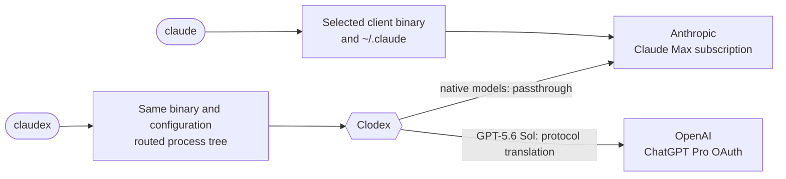

# Subscription routing setup

This package reproduces a two-subscription setup without placing provider API
keys in the client configuration:



`claudex` is the opt-in launcher that enables the isolated Clodex path for its
Claude Code process tree. Clodex then exposes GPT-5.6 Sol inside Claude Code
through the configured ChatGPT Pro OAuth route. A normal `claude` launch does
not enable Clodex and remains on the native Anthropic subscription path.

The direct and routed launchers intentionally coexist. `claude` remains the
baseline. `claudex` enables Clodex only for that process tree, including fresh
agents and workflow workers; Clodex performs the routing. The launcher does not
replace the normal login, settings, status line, plugins, skills, agents,
session history, or project configuration.

Two client profiles are supported:

- **Enhanced client:** the current cc-enhanced build owns all client changes and
  exposes the complete model catalog, picker, context, prompt, agent, and
  workflow behavior.
- **Stock client:** an official Claude Code installation uses Clodex's own
  client patch for first-class routed aliases in `/model`, Agent, and Workflow
  calls. The routing wrapper and system-prompt propagation are otherwise the
  same. A completely untouched stock binary can route a top-level canonical
  model ID, but it does not provide the full `model: "sol"` experience and is
  not the documented stock profile.

The package targets WSL or Linux x86_64 with a systemd user session. Clodex is
portable to other platforms, but the supplied service and PasswordVault bridge
are platform-specific.

## How the profiles differ

In the enhanced profile, the cc-enhanced patcher owns the native binary, patch
catalog, aliases, context and effort metadata, Agent and Workflow model
selection, and prompt propagation. Do not run `clodex patch`.

In the stock profile, Clodex is the only client patch owner. Its patch builds
the routed model surfaces from the saved favorite and alias. Run `clodex patch`
after every stock Claude Code update or routed-model change.

Never apply both patchers to the same binary. Clodex handles provider OAuth,
selective routing, protocol translation, and lifecycle logging in both
profiles.

## Prerequisites

Install:

- Git and [mise](https://mise.jdx.dev/);
- a systemd user session and common POSIX utilities;
- `jq`;
- Windows PowerShell and `wslpath` when using the supplied WSL PasswordVault
  helper.

## 1. Select a client profile

### Enhanced client

Start from the parent directory where you want the source checkout:

```sh
export CLAUDEX_CLIENT_PROFILE=enhanced

(
set -eu

git clone \
  --branch main \
  --single-branch \
  https://github.com/camjac251/cc-enhanced.git \
  cc-enhanced

cd cc-enhanced
mise install
mise run native:update -- latest

claude --version
mise run status
)
```

The update performs the real-bundle patch verification, promotes by atomic
symlink replacement, and verifies the promoted client.

### Stock client

Keep the official `claude` command installed and confirm it works directly:

```sh
export CLAUDEX_CLIENT_PROFILE=stock

claude --version
claude
```

Do not install cc-enhanced over that binary. Complete the Clodex, credential,
wrapper, prompt, and model-selection steps below, then run `clodex patch`.

## 2. Install Clodex globally with mise

```sh
mise use -g node@lts
mise use -g --minimum-release-age 0 npm:@bman654/clodex@latest
mise tool npm:@bman654/clodex
mise which clodex
mise which clodex-claude
```

`mise use -g` installs Node.js and Clodex in the global mise configuration, so
the commands are available anywhere mise is activated.

## 3. Select and install a credential helper

For WSL with Windows PasswordVault:

```sh
(
set -eu

install -d -m 700 "$HOME/.local/libexec"
install -m 700 templates/claudex-credential-helper \
  "$HOME/.local/libexec/claudex-credential-helper"
install -m 600 templates/claudex-credential-helper.ps1 \
  "$HOME/.local/libexec/claudex-credential-helper.ps1"
)
```

For native Linux or macOS, provide an equivalent executable backed by Secret
Service, KWallet, Keychain, `pass`, or another secure store:

```sh
export CLODEX_CREDENTIAL_HELPER_PATH=/absolute/path/to/secure-helper
```

The helper must implement `get`, `set`, and `delete` operations. Use the same
absolute path during rendering and verification. Do not use a plaintext token
file.

## 4. Render the service and launchers

This example defaults to the supplied WSL helper but accepts the absolute
`CLODEX_CREDENTIAL_HELPER_PATH` override:

```sh
(
set -eu

mise_data_dir=${MISE_DATA_DIR:-"$HOME/.local/share/mise"}
mise_shims_dir="$mise_data_dir/shims"
PATH="$mise_shims_dir:$PATH"
export PATH

node_bin=$(command -v node)
clodex_bin=$(command -v clodex)
clodex_wrapper=$(command -v clodex-claude)
claude_bin=$(command -v claude)
client_profile=${CLAUDEX_CLIENT_PROFILE:-enhanced}
credential_helper=${CLODEX_CREDENTIAL_HELPER_PATH:-"$HOME/.local/libexec/claudex-credential-helper"}
launcher_process_wrapper="$HOME/.local/libexec/claudex-process-wrapper"
prompt_composer="$HOME/.local/libexec/claudex-compose-system-prompt"

case "$client_profile" in
  enhanced|stock) ;;
  *) printf '%s\n' 'client profile must be enhanced or stock' >&2; exit 1 ;;
esac
case "$credential_helper" in
  /*) ;;
  *) printf '%s\n' 'credential helper path must be absolute' >&2; exit 1 ;;
esac
test -x "$node_bin"
test -x "$clodex_bin"
test -x "$clodex_wrapper"
test -x "$claude_bin"
test -x "$credential_helper"

if ! systemctl --user is-active --quiet claudex-clodex.service; then
  "$node_bin" - 3457 <<'NODE'
const net = require('node:net');
const port = Number(process.argv[2]);
const server = net.createServer();
server.once('error', error => {
  process.stderr.write(`port ${port} is unavailable: ${error.message}\n`);
  process.exitCode = 1;
});
server.listen({ host: '127.0.0.1', port, exclusive: true }, () => server.close());
NODE
fi

rendered_dir=$(mktemp -d)
trap 'rm -rf "$rendered_dir"' 0 HUP INT TERM

sed \
  -e "s|@HOME@|$HOME|g" \
  -e "s|@CLODEX_BIN@|$clodex_bin|g" \
  -e "s|@CLODEX_CREDENTIAL_HELPER@|$credential_helper|g" \
  templates/claudex-clodex.service >"$rendered_dir/claudex-clodex.service"
sed \
  -e "s|@CLODEX_BIN@|$clodex_bin|g" \
  -e "s|@CLAUDE_BIN@|$claude_bin|g" \
  -e "s|@CLODEX_CREDENTIAL_HELPER@|$credential_helper|g" \
  templates/clodex >"$rendered_dir/clodex"
sed \
  -e "s|@CLODEX_BIN@|$clodex_bin|g" \
  -e "s|@CLODEX_CLAUDE_BIN@|$clodex_wrapper|g" \
  templates/clodex-service >"$rendered_dir/clodex-service"
sed \
  -e "s|@CLODEX_CLAUDE_BIN@|$clodex_wrapper|g" \
  -e "s|@CLAUDEX_CLIENT_PROFILE@|$client_profile|g" \
  templates/claudex-process-wrapper >"$rendered_dir/claudex-process-wrapper"
sed \
  -e "s|@CLAUDE_BIN@|$claude_bin|g" \
  -e "s|@CLODEX_CLAUDE_BIN@|$clodex_wrapper|g" \
  -e "s|@CLAUDEX_PROCESS_WRAPPER@|$launcher_process_wrapper|g" \
  -e "s|@CLAUDEX_PROMPT_COMPOSER@|$prompt_composer|g" \
  -e "s|@CLODEX_CREDENTIAL_HELPER@|$credential_helper|g" \
  templates/claudex >"$rendered_dir/claudex"

install -d -m 700 "$HOME/.local/share/claudex-clodex"
install -d -m 700 \
  "$HOME/.config/systemd/user" \
  "$HOME/.local/bin" \
  "$HOME/.local/libexec"
install -m 600 "$rendered_dir/claudex-clodex.service" \
  "$HOME/.config/systemd/user/claudex-clodex.service"
install -m 700 "$rendered_dir/claudex" "$HOME/.local/bin/claudex"
install -m 700 "$rendered_dir/clodex" "$HOME/.local/bin/clodex"
install -m 700 "$rendered_dir/clodex-service" "$HOME/.local/bin/clodex-service"
install -m 700 "$rendered_dir/claudex-process-wrapper" \
  "$launcher_process_wrapper"
install -m 700 templates/claudex-compose-system-prompt \
  "$prompt_composer"

systemctl --user daemon-reload
)
```

Prepending the stable mise shims directory is intentional. The rendered files
store version-independent shim paths, so installing a newer Clodex release
changes the shim target without embedding the release number in the service or
launchers.

The unit stays disabled. `claudex` starts it on demand; `claude` does not use
it.

The service clears provider API keys, alternate provider base URLs, and routing
overrides. Optional proxy or private-CA settings belong in:

```text
~/.config/claudex-clodex/network.env
```

The file may contain `HTTPS_PROXY`, `NO_PROXY`, or `NODE_EXTRA_CA_CERTS`. Keep
it mode 600 and do not put provider API keys in it.

## 5. Install and compose the routed prompt

The routed prompt is the managed `/etc/claude-code/system-prompt.md` plus the
routing-specific policy. Install the reviewed overlay, then run the same
composer that `claudex` invokes before every default launch:

```sh
(
set -eu

prompt_directory="$HOME/.config/claudex-clodex"
install -d -m 700 "$prompt_directory"
install -m 600 templates/system-prompt-routing.md \
  "$prompt_directory/routed-model-policy.md"
"$HOME/.local/libexec/claudex-compose-system-prompt"
)
```

Rerun this block when the routing template changes. Managed prompt changes are
picked up automatically on the next `claudex` launch. The composer writes
atomically, preserves an unchanged file without requiring write access to its
directory, and fails closed when either source is unreadable. Set
`CLAUDEX_SYSTEM_PROMPT_FILE` only when intentionally replacing the composed
prompt for a launch; explicit replacements are not overwritten. The static
verifier reconstructs the default file byte-for-byte.

The prompt is append-only and contains no credentials. It teaches parent and
child contexts that an explicit request for Sol means a per-call
`model: "sol"` selection; it does not force every child to Sol.

## 6. Start, authenticate, and select the model

Start the service after the global Clodex tool and rendered unit are installed:

```sh
systemctl --user start claudex-clodex.service
clodex providers auth openai
clodex providers list
clodex models
```

In the model manager:

1. Favorite `gpt-5.6-sol` from provider `openai-oauth`.
2. Save the lowercase alias `sol`.

For the enhanced profile, stop here. The administration wrapper rejects
`clodex patch` because cc-enhanced already owns the binary.

For the stock profile, apply Clodex's model patch after saving the favorite and
alias:

```sh
clodex patch
```

Run that command again after every stock Claude Code update or after changing
the routed favorite or alias.

Both documented profiles expose Sol's `low`, `medium`, `high`, `xhigh`, and
`max` effort levels with `medium` as the model default. The enhanced profile
gets those capabilities from `CLAUDE_CODE_CONFIGURED_MODEL_CATALOG`; the stock
profile gets them from Clodex's client patch. Clodex preserves the selected
`xhigh` or `max` value when it builds the GPT-5.6 provider request.

`effort-stack` is needed only for `max` plus ultracode workflows. It is not
required for ordinary Sol `xhigh` or `max` selection.

Do not put the route, alias, base URL, or credentials in
`~/.claude/settings.json`. The launcher injects these values only into routed
processes.

## 7. Verify

```sh
./verify-static.sh          # enhanced profile
./verify-static.sh --stock  # stock profile, after clodex patch
```

```sh
./verify-live.sh          # enhanced profile
./verify-live.sh --stock  # stock profile
```

Opt-in direct, passthrough, and translated inference smoke tests:

```sh
./verify-live.sh --smoke          # enhanced profile
./verify-live.sh --stock --smoke  # stock profile
```

The smoke flag consumes subscription usage. It is not part of static
installation validation.

After installation, confirm `claudex sol`, a fresh Agent with `model: "sol"`,
and a Workflow worker with `model: "sol"` all route correctly. Confirm a normal
`claude` session still uses only native models.

## Usage

```sh
claude                 # direct client, Claude Max, no routing environment
claudex                # routed session, preserve the saved native parent
claudex fable          # Fable parent through native passthrough
claudex opus           # Opus parent through native passthrough
claudex sol            # Sol parent through ChatGPT Pro OAuth
clodex providers list  # isolated provider administration
clodex models          # isolated favorites and aliases
clodex-service restart # guarded service restart after routed clients are idle
```

Inside a native parent, request a Sol specialist by selecting the normal agent
type and setting `model: "sol"`. In a Workflow, set `model: "sol"` on each
selected `agent(...)` call. Do not encode the provider model ID in prompts or
workflow source.

The isolated Clodex home is `~/.local/share/claudex-clodex`.

## Safe updates and restarts

Updating the globally activated Clodex tool changes the target selected by its
mise shims, but it does not restart the running service or replace code that
process already loaded.
`Restart=on-failure` is not an upgrade watcher: systemd acts only after the
service exits unsuccessfully. A bridge that remains alive while returning
routed 5xx responses is still considered running.

Clodex loads provider adapters on demand. If mise removes the previous package
version while its service is still running, a later Sol request can try to load
an adapter from that removed installation. Treat the tool upgrade and service
restart as one maintenance operation. Let routed sessions finish, then run:

```sh
mise use -g --minimum-release-age 0 npm:@bman654/clodex@latest
mise reshim
mise tool npm:@bman654/clodex
mise which clodex
mise which clodex-claude
clodex --version
```

The version-specific `mise which` paths should change after an update; the
installed service and launchers continue to point at stable shims. Reload
systemd only when the unit template changed, then restart the idle service and
verify the installation:

```sh
clodex-service restart
./verify-static.sh
./verify-live.sh
```

`claudex` holds a shared routed-session lock for the client lifetime.
`clodex-service restart` acquires the matching exclusive lock before invoking
systemd and refuses to restart while routed sessions are active. Do not bypass
it with a direct `systemctl restart` during normal maintenance.

The unit remains disabled by design. A WSL shutdown stops the running user
service; the next `claudex` launch starts it on demand. When the unit is
inactive, no stale Clodex process remains loaded.

For a client update:

1. Enhanced profile: run `mise run native:update -- latest`.
2. Stock profile: update Claude Code normally, then run `clodex patch`.
3. Rerender the launchers if the mise data directory, selected client profile,
   credential-helper path, or `command -v claude` changed.
4. Reinstall the routing overlay if its reviewed template changed.
5. Run the applicable static and live verification commands.

## Troubleshooting

### Sol is missing from `/model`

Launch with `claudex`, not `claude`, then run the applicable static verifier.
For a stock client, rerun `clodex patch`.

### The routed launcher is blank or slow

Check:

```sh
systemctl --user status claudex-clodex.service --no-pager
journalctl --user-unit claudex-clodex.service --since today --no-pager
```

If authentication remains invalid, rerun `clodex providers auth openai`. Do not
print credential-helper output or set provider API-key variables.

### Sol agents stay idle or return package-import 502s

A worker with only its initial message and no real assistant turn does not prove
that the Sol model is unavailable. Check whether translation failed before any
provider request:

```sh
mise which clodex
clodex --version
systemctl --user show claudex-clodex.service \
  --property=ActiveState,SubState,MainPID,ExecMainStartTimestamp
jq -c 'select(.event == "translation_failed" or .event == "upstream_error")' \
  "$HOME/.local/share/claudex-clodex/logs/inference-requests.jsonl"
```

If the error says that a provider package cannot be found and names an older
mise installation directory, the installed tool and loaded service diverged.
No provider request was made; changing model aliases, OAuth credentials, or
Claude Code effort settings will not repair it.

If the service is inactive, start a routed client with `claudex`; it will start
the currently installed service on demand. If the service is active, close all
routed clients and run `clodex-service restart`.

If an already-broken routed client cannot release the shared lock, a direct
restart is an emergency recovery:

```sh
systemctl --user restart claudex-clodex.service
```

This interrupts every routed client and bypasses the normal safety guard. Use
it only after accepting that impact, then rerun any workers that retained the
synthetic error.

### The client reports `Unable to connect to API (ECONNRESET)`

Match the terminal timestamp to the lifecycle log:

```sh
jq -c 'select(
  .event == "response_failed"
  or .event == "translation_failed"
  or ((.event // "") | startswith("proxy_"))
)' "$HOME/.local/share/claudex-clodex/logs/inference-requests.jsonl"
```

Interpret the bounded diagnostic fields together:

- `response_failed` with `failureSource: "adapter_request_error"` and
  `errorCode: "ECONNRESET"` means the local proxy-to-adapter connection failed.
- `translation_failed` with
  `errorCode: "websocket_transport_error"` means the provider transport failed.
- `response_client_disconnected` with
  `terminationSource: "downstream_client"` means the client or worker cancelled
  the request.

### The context meter jumps at the start of a translated turn

If a translated turn still jumps by approximately the full prompt size and
then falls when the response completes, update Clodex and use
`clodex-service restart`. No cc-enhanced context override is required.

## Removal

Remove the provider first so Clodex can delete its OAuth credential through the
configured helper:

```sh
(
set -eu

clodex providers remove openai-oauth
systemctl --user stop claudex-clodex.service
mise use -g --remove npm:@bman654/clodex
rm -f \
  "$HOME/.config/systemd/user/claudex-clodex.service" \
  "$HOME/.local/bin/claudex" \
  "$HOME/.local/bin/clodex" \
  "$HOME/.local/bin/clodex-service" \
  "$HOME/.local/libexec/claudex-process-wrapper" \
  "$HOME/.local/libexec/claudex-compose-system-prompt"
rm -rf \
  "$HOME/.config/claudex-clodex" \
  "$HOME/.local/share/claudex-clodex"
systemctl --user daemon-reload
)
```

Delete the supplied helper files only after provider removal confirms credential
deletion. Removing the routed setup does not alter the promoted client, the
normal Claude configuration, or the Claude Max login.
